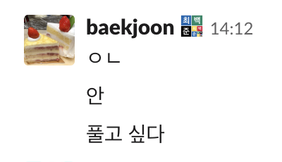

# 진짜 구데기컵 2018 에디토리얼

- 대회 공지사항: https://www.acmicpc.net/board/view/34173
- 대회 링크: https://www.acmicpc.net/contest/view/385
- 대회 다시 풀어보기: https://www.acmicpc.net/category/detail/2018 (우연히도 번호가 2018이다.)

제1회 구데기컵이 재미를 추구했다면, 진짜 구데기컵 2018은 구데기성을 추구했다. 2018년을 구데기컵의 해라고 부를 수 있을 정도로, 작게는 모 BOJ 대회부터, 크게는 대기업이나 국가가 주최하는 대회까지 사건사고가 많이 터졌기 때문이다. 제1회 구데기컵은 "구데기컵"이 아니라 "만우절컵"이라는 말도 있었을 정도이다. 그러나 진짜 구데기컵 2018이 실천한 구데기 요소는 구데기컵이 하더라도 참가자의 기분을 상하게 할 수 있는 행동임에는 변함이 없다. 구데기컵은 구데기이기 이전에 대회이다. 그 사실을 필자를 비롯한 주최진은 간과하고 있었던 것 같다. 이후의 구데기컵에서는 참가자가 피해를 받지 않도록 조심할 수 있기를 바라 본다.

## ☑️. 빙고

**첫 해결:** cheetose (67분)

"몸 풀기용 간단한 문제"는 거짓말이고, 밑에 주어진 자기참조 퍼즐(self-referential puzzle)을 풀어야 한다. 이런 종류의 퍼즐을 좋아한다면 [Self-referential Aptitude Test](http://faculty.uml.edu/jpropp/srat.html)도 풀어보도록 하자.

- 해결방법 1 - 직접 퍼즐을 푼다. 접근 방법은 여러 가지가 될 수 있고, 출제자의 풀이는 [이 링크](files/2nd-bingo.md)에서 볼 수 있다.
- 해결방법 2 - 브루트 포스 프로그램을 작성한다. 출제자는 답을 검증하기 위해 파이썬으로 약 2,000 바이트의 프로그램을 작성했다. 이때 B5의 조건"이 문제의 정답은 1개가 아니다"은 구현할 수 없으므로 제거한다. 그러면 B5를 색칠했는지 안 했는지에 따라 두 개의 답이 나오는데, 출제자의 풀이의 맨 마지막에 이를 어떻게 해결해야 하는지가 적혀 있다. 또는 그냥 두 번 제출해도 된다.
- 해결방법 3 - 2^25개의 답을 모두 검사할 필요가 없다. 예를 들어 D1과 D4는 둘 다 색칠되어 있거나 둘 다 색칠이 안 되어 있고, A5와 E5도 마찬가지이고, A2와 A4 중 정확히 하나만 색칠되어 있다. C3가 색칠되지 않으면 C3 자신의 조건이 만족되므로 모순이다. 따라서 C3는 색칠되어야 한다. 같은 방식으로 B1도 색칠되어야 한다. 이 정도만 알아내도 답의 후보는 2^20개로 줄어든다.

## 🤔. Thinking Language

**첫 해결:** doju (140분)

난해한 프로그래밍 언어(esoteric programming language)라는 것은 자명하다. "무슨 이유인지 이 언어는 유명해졌다."로부터 이 언어는 [Esolang 위키](https://esolangs.org/wiki)에 있음을 유추할 수 있고, "이 언어는 계속 사색에 잠길 뿐 아무것도 하지 않는다."로부터 이 언어는 "Unusable for programming" 태그를 가지고 있음을 유추할 수 있다.

[해당 태그 목록](https://esolangs.org/wiki/Category:Unusable_for_programming)에 들어가면 예제 출력에 있었던 [Huh?](https://esolangs.org/wiki/Huh%3F) 언어가 눈에 띈다. 해당 문서에 있는 Visual Basic .NET interpreter를 받아서 huh.exe에 예제 입력을 넣으면 예상대로 예제 출력이 나오는 것을 볼 수 있다. 이제 이 프로그램에 입력 파일을 넣으면 된다.

같은 문서에 있는 Python interpreter로 예제를 돌리면 제대로 출력되지 않는다. `print "..."` 앞에 `else:`를 붙여야 제대로 작동한다. ~~게다가 파이썬 버전이 2.7이라는 심각한 문제점도 있다.~~

참고로 입력 파일은 영어권에서 굉장히 유명한데 한국에는 거의 알려지지 않은 밈 중 하나인 꿀벌 대소동(Bee Movie) 전체 대사집이다. 작년 구데기컵에서도 이런 인지도의 밈을 사용한 적이 있다.

## 🥞. 파이의 왕 김파이

**첫 해결:** cubelover (495분)

~~작년의 Binary Game에 이은 난해한 프로그래밍 언어 문제이다.~~

문제에 주어진 것을 그대로 구현해도 시간복잡도 상으로 잘 돌아간다. 단, Python은 굉장히 느린 언어이므로 Pypy와 Pike로 제출해야 한다.

하지만 이게 끝이면 구데기컵에 냈을 리가 없다. 첫 줄에 N, L, R, 둘째 줄에 나머지가 들어온다고 한 적이 없기 때문에, 공백의 종류 및 개수를 무시하고 입력을 받아야 한다. Pypy의 경우 `sys.stdin.read().split()`을 하는 방법이 있다.

**아래 문단은 전부 대회 당시의 지문을 기준으로 작성한 것이며, 현재의 지문과 관련이 없습니다.** [수정 요청 글](https://www.acmicpc.net/board/view/87639)을 참조하세요.

~~이 문제는 출제자가 1년 동안 쌓은 분노를 모아 만든 문제이다.~~

~~BOJ의 몇몇 문제는 단순히 C++ 정해 코드만 만들어서 대충 검수하고 공백과 줄바꿈이 잘 되어 있는지, 또는 5개의 수가 주어져야 되는데 6개나 주어지진 않는지 등이 전혀 검사되지 않았다. 예를 들면 "첫째 줄에 N이 주어진다. 둘째 줄에 N개의 정수가 주어진다."라고 했는데 아래와 같은 데이터가 있거나,~~

```
3
10
11
12
```

~~아래와 같은 데이터가 있는 것이다. (놀랍게도 실제로 그런 문제가 있었다.)~~
```
5
10 11 12 13
```

~~이렇게 하면 C++의 입력 방식으로 입력을 받아야 통과하고 다른 언어로 짜면 아무 이유 없이 런타임 에러나 틀렸습니다를 받을 위험이 있는 문제가 탄생한다. C++로 짜도 어떻게 짜느냐에 따라 아무 이유 없이 틀릴 수도 있다. 출제자는 이 대회가 열리기 전까지 이런 문제를 정확히 20개 찾아냈고, 그 중 2018년 BOJ 대회 문제는 무려 5개나 된다.~~

~~따라서 이 문제를 풀려면 공백을 무시하고 마치 C++의 `scanf`나 `cin`처럼 입력을 받는 것을 구현해야 한다. 파이썬의 경우 `sys.stdin.read()`로 모든 입력을 한꺼번에 받는 방법이 있다.~~
```
INP = iter(__import__('sys').stdin.read().split())
input = lambda: next(INP)
```
~~그런데 이렇게 해도 **맞았습니다!!** 가 안 나온다! 그 이유는 공백 외의 원인으로 입력 데이터가 잘못될 수 있기 때문이다. 구체적으로, 위에 언급된 두 번째 예시처럼 수가 N개가 주어져야 하는데 N개보다 적게 주어지는 경우가 있다. 이 경우에는 어떻게 입력받아야 할까?~~

~~잠시 파이썬을 버리고 C++로 이 문제를 풀었다고 생각해 보자. 그렇다면 대부분의 사람들은 다음과 같이 입력을 받을 것이다. (물론 `scanf`를 쓸 수도 있지만, 결국에는 똑같다. `vector<int>`도 있겠지만, `int[]` 대신 그 방법을 쓰는 사람들은 많지 않은 것으로 보인다.)~~
```
int pie[12345];
int main(){
    int n,l,r; cin>>n>>l>>r;
    for(int i=0; i<n; i++) cin>>pie[i];
}
```
~~이렇게 하면 입력받지 않은 `pie[]` 값은 전부 0이다. 따라서 불성실한 출제자가 이렇게만 검수를 했다면, N-1개의 수만 들어왔을 경우 마지막 수는 0이 된다. 이를 파이썬으로 구현하면 다음과 같다.~~
```
pie = [0] * n
for i in range(n):
    try: pie[i] = int(input())
    except: pass
```

~~대회 운영진 및 출제진이 주의하여 제대로 된 데이터를 만들어 주었으면 하는 소망에 이 문제를 만들었다. 하지만 매우 위험한 시도였고, 앞으로 이런 문제를 다시는 만들지 않으려고 한다. 이런 문제가 계속되면 더 이상 구데기컵에 대해 아무것도 믿을 수 없게 되기 때문이다. (심지어 이 소망은 이 대회조차 제대로 지키지 못했다.)~~

## ⚡. 연결그래프의 모든 간선의 저항이 1Ω일 경우 간선으로 직접 이어진 모든 쌍의 점 A, B 에 대해 A와 B 사이의 합성저항 값의 총합을 구한 뒤 소수점 넷째자리에서 반올림한 값을 출력하는 문제

**첫 해결:** stet_stet (201분)

[Resistance Distance](https://en.wikipedia.org/wiki/Resistance_distance) 문서를 참고하자. 문제에 주어진 조건대로라면, 구하고자 하는 값은 회로의 형태와 관게없이 항상 (n-1)이다.

위의 문서 내용을 모르더라도, 전기회로를 분석할 때 자주 사용되는 [중첩 원리](https://en.wikipedia.org/wiki/Superposition_principle)와 옴의 법칙만을 사용해서 정답이 (n-1)임을 유도할 수 있기도 하다.

## 🦁. Africa 2

**첫 해결:** cheetose (99분)

다음과 같이 세 가지 방법으로 풀 수 있다.
1. Africa 채점에 사용되는 데이터를 확보한 뒤 그 중 절반에 대해서만 맞는 코드를 짠다.
2. 여러 번의 시행착오를 통해 데이터에 대한 정보를 얻는다. 다음과 같은 방법을 시도할 수 있다.
  - 입력과 관계 없이 무조건 틀린 답(예. -1)을 출력하는 코드를 제출한다. 그러면 전체 데이터의 개수를 알 수 있다.
  - n이 특정한 값 이상/이하일 때만 정답을 출력하는 코드를 제출한다.
  - 첫 번째 나라가 특정한 나라일 때만 정답을 출력하는 코드를 제출한다.
  - 이상의 과정을 반복하여 전체 데이터의 절반에 해당하는 조건을 찾는다.
참고로 출제자이면서 참가자였던 브라이언(이는 문제에서 유추할 수 있다.)은 다음과 같은 코드를 제출해서 정답을 받았다.
```
(...)
if n == 8 and (first_country != "kenya" or second_country != "tanzania")
  puts -1
else
  puts cost
end
```
3. 답을 구한 뒤, 그 답을 랜덤 시드로 설정한다. 이제 시드 랜덤을 사용하여 1/2의 확률로 답을 출력한다. 입력이 같으면 시드도 같으므로 출력 결과도 같다. 만점이 나오지 않는다면 답을 출력할 확률을 올리거나 내린다. 운영진인 jh05013은 이 방법으로 정답을 받았다.

## 📉. Is it rated?

**첫 해결:** tncks0121 (143분)

우선, `https://codeforces.com/api/contest.list?gym=false` 에서 지금까지 코드포스에서 열렸던 모든 대회의 목록을 json 형태로 볼 수 있다.
여기서 대회 id와 이름 쌍을 모은 뒤, `https://codeforces.com/api/contest.ratingChanges?contestId={id}` 형식의 링크에서 해당 대회에서의 유저들의 레이팅 변화를 볼 수 있다.
id를 직접 모으지 않더라도, 1~1130 처럼 연속된 번호로 대회를 찾아도 된다.

- https://codeforces.com/api/contest.ratingChanges?contestId=891 의 경우 긴 목록을 볼 수 있다.
- https://codeforces.com/api/contest.ratingChanges?contestId=926 의 경우 목록이 아주 짧다. unrated이기 때문이다.
- https://codeforces.com/api/contest.ratingChanges?contestId=179 의 경우 없는 대회 번호이기 때문에 짧다.

이 방식으로 모든 대회 id에 대해 위 링크에서의 요청 결과의 길이를 보고, 길이가 길면 rated, 짧으면 unrated로 판단하면 된다.

리퀘스트 결과가 FAILED인 것으로 unrated 여부를 판별하면 오답을 받는다. 초반 대회 중 unrated인 것들은 FAILED는 없고 레이팅 변동 목록만 비어 있기 때문이다.

## ⚔️. 습격자 초라기와 쿼리 (Easy)

**첫 해결:** 이 문제는 구데기컵에 출제된 문제가 아니다.

이문제는 습격자 초라기에 쿼리를 섞으면 어떻게 될까 마음에 만들어본 문제입니다.
그런데 진짜 습격자 초라기에 쿼리까지 추가해버리면 너무 어렵기 때문에 원이 두개가 아닌 1나만 있는 Easy 버전을 출제했읍니다.

쿼리가 없는 경우를 원래 DP로 O(n)에 풀수 있는 문제지만 분할 정복으로 O(nlogn)에도 풀 수 있다 것이 이 문제에 핵심 아이디어이다.
일단 원이 아니라 직선으로 펼쳐놓은 문제를 생각해봅시다. 구역 a부터 b까지를 커버하는데 필요한 특수 소대에 최소 갯수를 f(a, b)라 하면 f(1, n)에 값은

f(1, n/2) + f(n/2+1, n)

만약 구역 n/2과 n//2+1에 배치된 적에 수에 합이 w보다 작으면, f(1, n/2-1) + f(n/2+2, n)

중 최소값입니다. 그런데 점화식에서 함수 f를 재귀적으로 4번 부르죠. 미스터정리를 쓰면 시간복잡도가 O(n^2)입니다.
이걸 해결하기 위해 함수을(를) 4개 정의합니다.

* f1(a, b): a부터 b까지 커버하는 데 필요한 최소값
* f2(a, b): a+1부터 b까지 커버하는 데 필요한 최소값
* f3(a, b): a부터 b-1까지 커버하는 데 필요한 최소값
* f4(a, b): a+1부터 b-1까지 커버하는 데 필요한 최소값

이렇게 정의된 함수들의 점화 관계를 세우면 O(nlogn)으로 해결할수 있다.
(물론 분할 과정에서 중복으로 호출 되는 함수들은 메모리제이션을 꼭 하도록 합시다.
함수를 4개 정의하면 생기는 또 다른 장점은, f4(1, n)에 값을 계산하면 직선으로 펼친 문제 뿐만 아니라 원래의 원형에서도 최소값을 구합니다.

커리는 f1, f2, f3, f4를 저장하는 세그먼트 트리를 만들어서 해결하면 됩니다.
초기화에 O(nlogn)이 걸리고 업데이트 밑 쿼리 답변에 O(logn)이 걸림으로 최종 시간복잡도는 O((n+q)logn)에문제를 풀수있다.

전체적인 풀이는 [16993번 연속합과 쿼리](https://www.acmicpc.net/problem/16993) 문제와 비슷합니다.

## 💽. 인코딩

**첫 해결:** mori_inj (종료 이후)

일단 문제가 알 수 없는 문자열로 적혀 있는데, 이 문제를 windows-1252로 디코딩한 후 다시 UTF-8로 인코딩하면 아래와 같다.

### 문제
문자 인코딩, 또는 인코딩은 문자나 기호들을 컴퓨터에서 표현하는 방법을 말한다. 인코딩을 통해 문자나 기호들은 문자 코드가 되며, 이를 복호화하면 다시 원래의 문자가 된다.

인코딩의 대표적인 예로는 모스 부호가 있으며, 영어 알파벳과 숫자, 특수 문자 등을 정수로 대응시키는 아스키도 존재한다.

### 입력
첫 글자가 한글이고, 반 이상이 한글로 이루어진 문자열을 UTF-8로 디코딩하여 새로운 인코딩 방식으로 다시 인코딩된 문자열이 주어진다.

### 출력
새 인코딩 방식의 이름을 출력한다. 여러 인코딩 방식이 가능하다면 그 중 하나만 출력해도 된다. 등장하는 인코딩 방식은 다음 중 하나이다.

`EUC-KR, IBM-Thai, Shift_JIS, UTF-8, windows-1252`

### 예제 입력
`諛깆� �⑤씪�룁��吏�`

### 예제 출력
`EUC-KR`

일단 각 인코딩에서 등장할 수 있는 특징적인 문자 목록을 살펴보자.

| 인코딩 | 문자 목록 |
| ---- | ---- |
| [EUC-KR](https://uic.win/ko/charset/show/euc-kr/) | 라틴 문자(반각/전각), **한글**, 한자(번체자), 히라가나와 가타카나(전각), 키릴 문자, 그리스 문자, 특수기호 |
| [IBM-Thai](https://www.compart.com/fr/unicode/charsets/IBM-Thai) | 라틴 문자(반각), **태국어**, 특수기호 |
| [Shift_JIS](https://uic.win/ko/charset/show/Shift_JIS) | 라틴 문자(반각/전각), 히라가나(전각), 가타카나(전각/**반각**), 칸지, 키릴 문자, 그리스 문자, 특수기호 |
| UTF-8 | 전부 |
| [windows-1252](https://uic.win/ko/charset/show/windows-1252) | 라틴 문자(반각 + **확장**), 특수기호 |

인코딩 과정 중에서 해당 캐릭터셋이 지원하지 않는 바이트가 있을 경우 `�`가 추가될 수 있기 때문에 정답을 알더라도
다시 복원을 시도할 경우 완벽하게 복원되지 않는다. 따라서 5개 인코딩으로 전부 복원해 보고 한글이 가장 많은 비율을 차지하는
인코딩을 출력하면 당연하게도 오답을 받게 된다.

한글은 유니코드에서 `AC00-D7AF`을 차지하고 있다. 이를 [UTF-8](https://en.wikipedia.org/wiki/UTF-8)로 인코딩할 경우
첫 번째 바이트는 `EA-ED`가 될 수 있으며, 두~세번째 바이트는 각각 `80-BF`가 될 수 있다.
따라서 문제의 조건에서 인코딩을 다시 하기 전 첫 바이트는 항상 `EA-ED`이었음을 알 수 있다.

먼저 [EUC-KR](https://uic.win/ko/charset/show/euc-kr/)은 1~2바이트 인코딩인데, 캐릭터 맵을 참조하면
첫 번째 바이트가 `EA-ED`라면 두 번째 바이트가 `A0-FF` 사이에 있어야 글자가 깨지지 않고 나타날 수 있다. 글자가 깨지지 않았다면, `Exxx`는 모두 한자이므로
첫 글자는 한자로 나타날 것이다. 따라서 첫 글자가 한글이라면 정답은 UTF-8임을 알 수 있다. 문제의 조건에 의해 역도 성립하므로 UTF-8은 쉽게 판별해낼 수 있다.

다음으로 [IBM-Thai](https://www.compart.com/fr/unicode/charsets/IBM-Thai)는 1바이트 인코딩인데, `EA`, `EB`, `EC`, `ED`가 모두
태국어 문자로 매핑되어 있다. 따라서 한글이 섞여 있는 문자열을 IBM-Thai로 다시 인코딩할 경우 맨 앞 글자로 태국어 문자가 등장하게 된다.
UTF-8은 이미 판별되었고 나머지 다른 인코딩 중 태국어가 표현 가능한 인코딩은 없으므로 입력된 문자열의 인코딩은 IBM-Thai이다.

또한 [windows-1252](https://uic.win/ko/charset/show/windows-1252)도 1바이트 인코딩이다.
`EA`, `EB`, `EC`, `ED`에 해당되는 문자들은 각각 `ê`,	`ë`, `ì`, `í`인데, 이 문자들은 확장 라틴어 문자들로
UTF-8과 windows-1252에만 등장할 수 있다. 따라서 이 경우도 IBM-Thai와 같은 방법으로 판별해낼 수 있다.

마지막은 EUC-KR과 Shift_JIS인데, 이 둘은 명확하게 구별하기 힘들다. 다만 Shift_JIS가 정답인 모든 데이터에는 반각 가타카나가 섞여 있었다. 구데기성을 살리기 위해 언급하지 않으려고 했으나, 스코어보드 상황을 보고 대회 중간에 '반각 가타카나 문자가 없으면 Shift_JIS가 아님이 보장'됨을 공지했다. 이를 통해 문제를 풀 수 있었다.

## 🍛. 3분 그래프

**첫 해결:** portableangel (81분)

맞은 사람이 나올 때마다 랜덤 값이 새로 생성되는 문제는 너무 예전 트렌드인 거 같아 누군가가 소스를 제출할 때마다 전자레인지 상태가 바뀌는 문제를 만들어 봤다.
컴파일 에러 또한 이렇게 활용할 수 있다는 걸 보여주고 싶었다. 

아래는 문제를 만들면서 예상한 참가자들의 행동이다.
* 다른 사람이 넣은 그래프를 가로채 꺼내 먹는다.
* 특정 주기마다 아무 소스나 제출해서 다른 사람들이 제출을 못 하게 막는다.

안타깝게도 후자 때문에 전자가 일어나는 건 보기 힘들었던 것 같다.

## 🍅. 하이퍼 토마토

**첫 해결:** wijae (62분)



[#7569](https://www.acmicpc.net/problem/7569), [#7576](https://www.acmicpc.net/problem/7576)번과 같은 방식으로 풀 수 있는 단순한 BFS 문제이다. 다만, 차원이 11일 뿐이다.

## ⛓️. Kudeki Chain

**첫 해결:** august14 (81분)

- 손채굴

문제 설명에 적힌대로 `success.txt`의 내용을 자신의 BOJ 아이디로 바꾸는 커밋을 한 뒤, `git commit --amend --no-edit --date "$(date)"` 와 같이 커밋의 시각만 바꾸어가며 원하는 만큼의 0가 hash의 앞자리에 등장할 때까지 반복하면 된다. 

- 자동화된 채굴

https://github.com/dj-shin/gitchain 와 같은 채굴 자동화 스크립트를 이용하는 방법도 있다.

약 9시간의 대회 시간동안에 8번째 커밋까지 있었다. 참고로 8번째 커밋의 경우 hash의 앞 8자리가 0이어야 하는데, 이렇게 될 확률은 1/(16^8), 약 42억분의 1이다.

- GPU 가속화된 채굴

GPU 프로그래밍으로 SHA1 해시 계산 알고리즘을 구현하여, CPU를 사용할 경우보다 훨씬 빠르게 원하는 해시를 찾아낸 정답자가 나타났다.
자세한 내용은 해당 유저의 [블로그 글](https://zigui.tistory.com/30)과 [소스코드](https://github.com/zigui-ps/githashjoke) 참조.

해당 유저는 이 방법으로 11, 12번째 커밋을 해냈고,
그 중 [11번째 커밋](https://github.com/seungwonpark/kudeki-chain/commit/0000000000009c012a4fcfe3b1f1d683163b0768)의 해시 `0000000000009c012a4fcfe3b1f1d683163b0768`는 github.com 의 모든 커밋 해시 중에서 가장 낮은 것으로 나타났다.
(2019년 3월 17일 이전의 모든 해시보다 낮으며, 현재까지의 모든 커밋과 비교했을 때에도 그럴 확률이 높음.
[관련 트윗](https://twitter.com/senokay/status/1132313325591703552) 참조)

## 👀. 목격자

**첫 해결:** rubix (114분)

원래 The Witness 문제였는데 갑자기 바바가 떠 버려서 바바로 바꿔버렸습니다.

이미지의 alt 속성에 데이터가 예제밖에 없다는 말이 적혀 있습니다.

예제를 통과하는 소스 코드를 짠 다음 제출하면 됩니다.

## ➗. 평가

**첫 해결:** mullijoa (53분)

절대/상대 오차가 10-6, 즉 4이므로, `0`을 찍으면 항상 정답을 받을 수 있습니다.

## 🐄. 갓 소수

**첫 해결:** kjp4155 (250분)

먼저, $x_{n+1} = ax_{n} + b$를 행렬의 형태로 고치면,$$\begin{pmatrix}x_{n+2}\\x_{n+1}\end{pmatrix} = \begin{pmatrix}a&b\\1&0\end{pmatrix}\begin{pmatrix}x_{n+1}\\x_{n}\end{pmatrix}$$이므로, 대각화가 될 것이라는 믿음을 가지고 대각화를 시행합니다. 그러면
\begin{align*}
    \begin{pmatrix}a&b\\1&0\end{pmatrix}^{p} &= \left(U \begin{pmatrix}\lambda_{1}&0\\0&\lambda_{2}\end{pmatrix} U^{-1}\right)^{p}\\
    &= U \begin{pmatrix}\lambda_{1}^{p}&0\\0&\lambda_{2}^{p}\end{pmatrix} U^{-1}\\
    &= U \begin{pmatrix}\lambda_{1}&0\\0&\lambda_{2}\end{pmatrix} U^{-1}\\
    &= \begin{pmatrix}a&b\\1&0\end{pmatrix}
\end{align*}
이므로, $x_{p} = ax_{0} + b$입니다. 예제 $1 = 860798509\cdot 1159672501 + 198609463$를 이용하면 $p$가 $860798509\cdot 1159672501 + 198609463 - 1 = 998244359987710471 = 998244353 \cdot 1000000007$의 약수라는 것을 알 수 있습니다.

그러나 이 모든 것은 대각화가 가능하다는 전제 하이므로, 실제로 $\lambda(\lambda - a) = b$가 해를 가지는지는 조사해 봐야 합니다. WolframAlpha를 통해 계산해 보면,\footnote{https://www.wolframalpha.com/input/?i=x(x+-+860798509)+\%3D+198609463+mod+998244353, https://www.wolframalpha.com/input/?i=x(x+-+860798509)+\%3D+198609463+mod+1000000007} 둘 다 해가 잘 존재하는 것을 알 수 있고, 우리는 {\large\textbf{망했습니다.}}

양쪽을 모두 넣어보면, $p = 1000000007$인 경우가 정답을 받는다는 것을 알 수 있습니다. 참고로 제가 실제로 가장 좋아하는 소수는 998244353\textbf{이었는데요}, 얼마 전에 469762049로 갈아탔습니다. 왜냐하면
\begin{align*}
    998244353 &= 2^{23} \cdot 7 \cdot 17 + 1,\\
    469762049 &= 2^{26} \cdot 7 + 1
\end{align*}
이므로 998244353 나부랭이랑 비교했을 때 8배 더 깊은 FFT를 시행할 수 있기 때문입니다. 여러분도 어서 갈아타세요, $\omega = 3$으로 최소 원시근이 같아서 원시근 다시 외울 필요도 없습니다!

참고로, 시간 제한이 -2초이므로 +5초인 언어 중 빠른 것으로 코드를 작성해야 하고, \texttt{int} 범위는 최솟값만 명시되어 있어서 임의 길이 정수 나머지 알고리즘을 짜야 합니다. 데이터는 최대 만 자리의 양수 음수 모두 들어오고, 저는 안 짜 봤습니다. 수고하시죠.

## 🌈. 오색 정리

**첫 해결:** ch1515 (150분)

문제를 다시 잘 읽어보자. 정점에 숫자를 부여하라고 했지, 인접한 정점끼리 색이 다르도록 색칠하라고 하지 않았다! 1 이상 5 이하의 숫자를 아무렇게나 N개 출력하면 된다.

같은 숫자를 N번 출력하면 "Codes from the Book"에 들어갈 정도로 아름답지 않아서 "틀렸습니다"를 받는다.

## 🐱. 이모지

**첫 해결:** rubix (종료 이후)

**정해는 없다.** 모든 데이터는 수작업으로 만들어졌다. 몇 가지 고려할 점을 나열하자면:

* 슬랙 메시지는 & 기호를 사용한 인코딩을 거쳐서 저장된다. 즉 `<`는 `&lt;`, `&`는 `&amp;` 등이다. 하지만 입력에 `<`가 들어올 수는 있다. 예를 들어 슬랙에 https://github.com 링크를 입력하면 내부적으로는 `<https://github.com>`으로 저장된다.
* `:dog:cat:`에는 고양이 이모지가 없다. 심지어 `:not_existing_emoji:cat:`에도 없다. 직접 슬랙에서 메시지를 입력하면서 정확한 규칙을 알아내도록 하자.
* 한 쌍의 억음부호 (backquote) 안에 들어가는 텍스트는 이모지로 변환되지 않는다.
* 각 줄은 독립적이지 않다. 세 억음부호를 붙이면 코드 블럭이 생겨 그 안에 있는 텍스트 모두가 이모지로 변환되지 않기 때문이다.
* 고양이 이모지 자체가 입력으로 들어올 수 있다. 그 경우에는 문제 설명에 따라 YES를 출력해야 한다.

등이 있다.

"사람이 풀 수 있는 문제를 지향"하는 구데기컵의 가치관에 어긋나는 문제가 아니냐고 반문할 수 있지만, 출제자는 이 문제를 사람이 풀 수 있다고 믿는다. 따라서 대회 종료 이후 부분점수 문제로 바꾸었고, 테스트케이스를 아래에 공개하기로 하였다.

Input | Output |
--- | --- |
[1.in](files/emoji-1.in) | [1.out](files/emoji-1.out) |
[4.in](files/emoji-4.in) | [4.out](files/emoji-4.out) |
[5.in](files/emoji-5.in) | [5.out](files/emoji-5.out) |
[8.in](files/emoji-8.in) | [8.out](files/emoji-8.out) |

5월 25일에 이 문제의 첫 만점자가 탄생했다. 하지만 실제 이모지 파싱 과정을 구현하지 않고, 입력의 해시값을 이분탐색 등으로 얻어낸 후 정답을 하드코딩하였다. 문제의 취지에는 맞지 않지만 엄연히 만점 코드이므로 예정대로 상품을 지급하기로 하였다.
