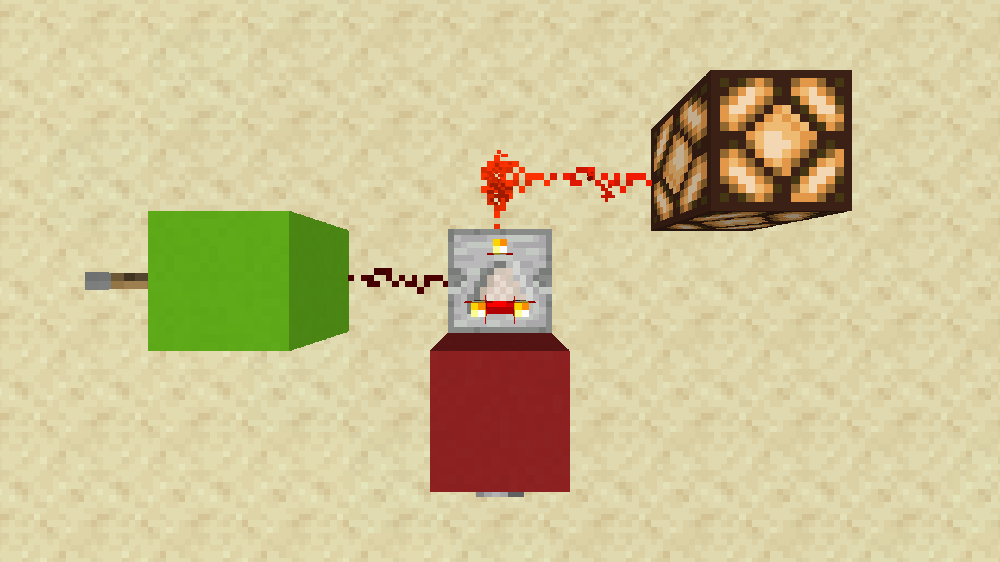
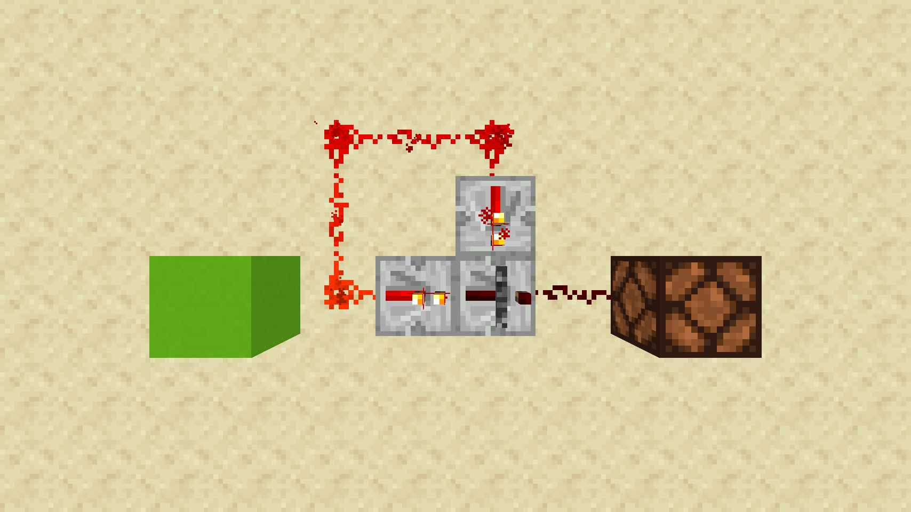
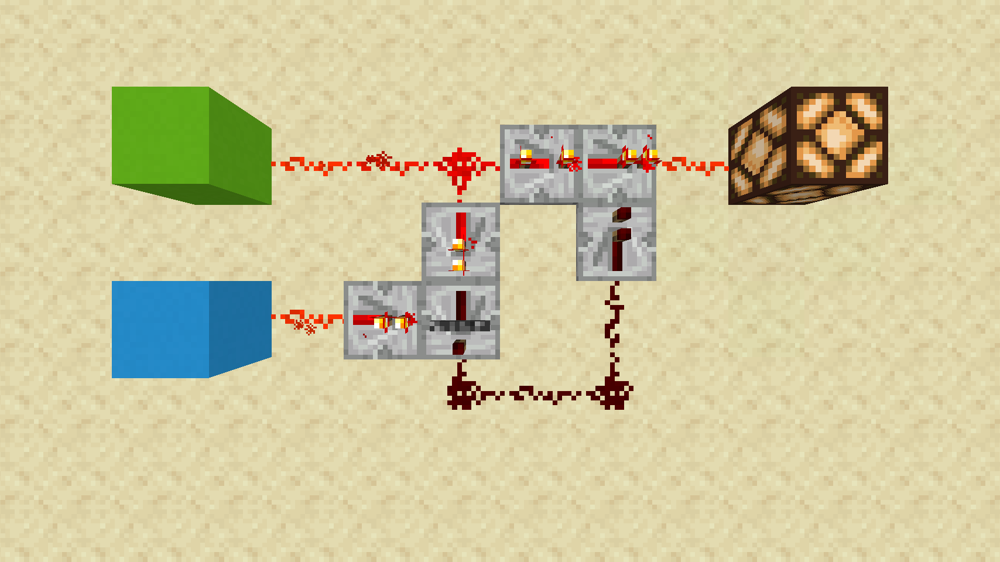
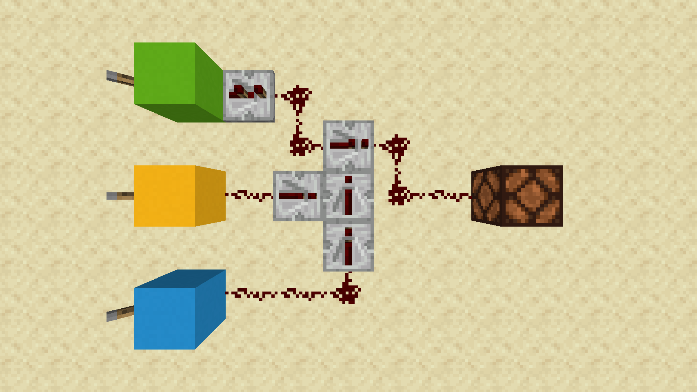
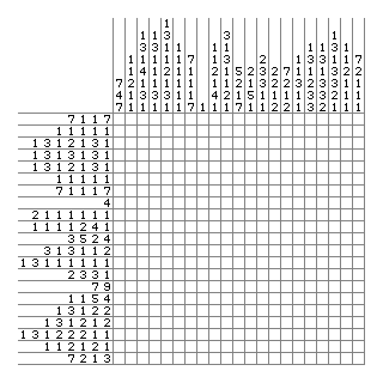
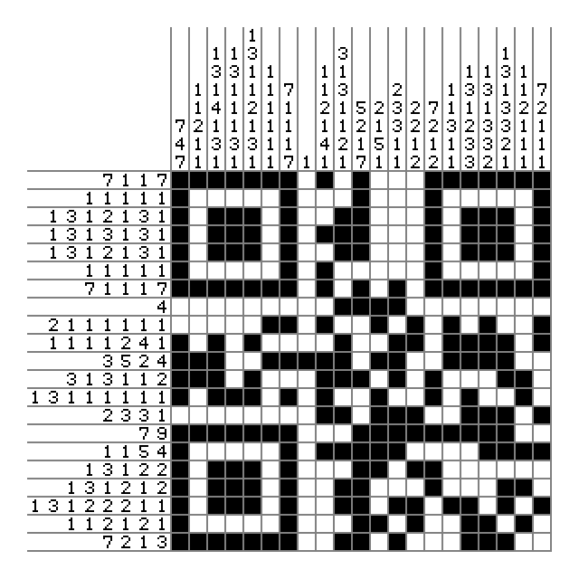
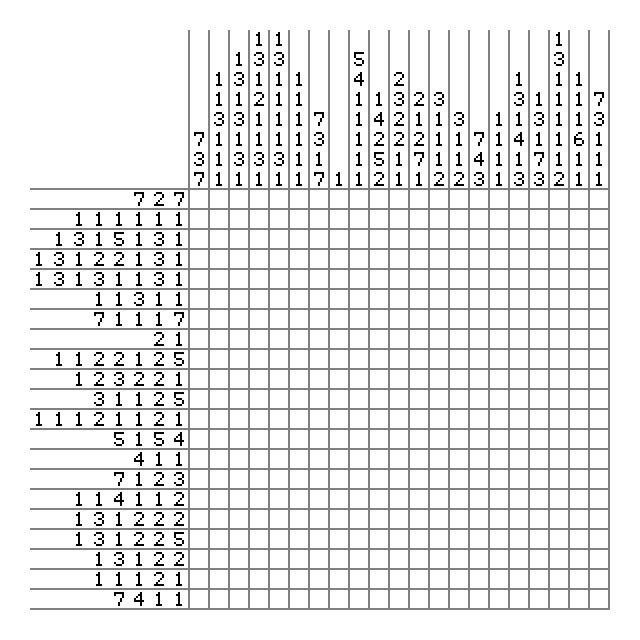

혹시 내년에도 저를 이으실 분이 계신다면 다음을 제안합니다:

- **모든 문제의 완전한 완성이 한 달 전에 완료되어야 합니다.** 그렇지 못한 문제는 과감하게 내년으로 미뤄 주시기 바랍니다. 이 문제들은 오랜 검수를 필요로 합니다. 또한 **완성 후에 검수를 하는 사람이 필요합니다.**
- **검수자는 절대로 출제자에게 문제에 대한 설명을 들어선 안 됩니다.** 대회 개최 규정에도 적혀 있습니다. 저의 불찰입니다...
- 특수한 형태의 문제가 상당히 많이 나올 수 있는데 검수자 3명은 너무 적은 것 같습니다. 훨씬 많아야 합니다.
- 검수자는 **맞는 것 같은데 틀린다면, 또는 조금이라도 이상한 것 같으면, 출제자에게 이의제기를 해야 합니다.** 출제자가 그 이의에 대해 확신을 가질 수 없다면, **이의가 타당하지 않더라도** 즉시 수정해야 합니다.

물론 제가 여는 것이 아니므로 판단은 다음에 여실 분께 맡기겠습니다.

누군가는 문제 설명이 틀린 것을 보고 "구데기컵이니까 그럴 수도 있는 거 아냐?"라고 생각할 수도 있겠지만, **준비가 소홀해서 발생한 문제를 구데기컵이랍시고 대충대충 넘어갈 바엔 대회를 열지 말아야 한다고 생각합니다.**

# 👀. 눈치게임 A+B! A-B! A+B! 터렛! A+B! 피보나치 함수! A+B! A-B! A+B! 어린 왕자! A+B! ACM Craft! A+B! A-B! A+B! 습격자 초라기! A+B! 벡터 매칭! A+B! A-B! A+B! A/B! A+B! 터렛! A+B! A-B! A+B! 분산처리! A+B! A+B! 마셔라! 마셔라 마셔라! 마셔라 틀이 들어간다!

*Speedrun Edition 최고 득점자: rubix (1분, 2147483647점)*

*Regular Edition 최고 득점자: 없음 (버그가 발생하여 제출이 불가능해졌다.)*

*Marathon Edition 최고 득점자: kyaryunha_cpp (8분, 2147483647점)*

현재 이 문제를 맞은 사람의 수에 따라 풀어야 하는 문제가 정해지기 때문에, 이 문제를 맞힌 사람의 수를 잘 따져봐야 한다. 또한, 맞은 사람은 각각의 에디션에서 공유되기 때문에, **세 에디션의 스코어보드**를 모두 확인해야 맞은 사람의 수를 정확히 셀 수 있다. 사실 이조차도 **정확하지 않은데,** 참가자가 보는 스코어보드는 대회 종료 **30분 전에 프리즈된** 스코어보드이기도 하고, **운영진의 제출**은 스코어보드에 나타나지도 않기 때문이다. (그래서 대회 운영진은 웬만하면 이 문제에 제출을 하지 않았다.)

그런데 대회 중에 이 문제의 채점에 버그가 발생하였고, 이로 인해 재채점이 발생하며 **스코어보드를 통해 알 수 있었던 맞은 사람의 수가 실제와 현저하게 다르게 되었다.** 이를 해결하기 위해 현재까지 맞은 사람에 대한 공지가 이루어지면서, Marathon Edition의 참가자는 **이 공지사항과 Marathon Edition의 스코어보드만을 통하여 맞은 사람의 수가 얼마인지** (스코어보드가 프리즈되는 대회 종료 30분 전까지는) **정확하게 알 수 있게 되었다.**

물론, 풀어야 하는 문제가 뭔지 모르겠다면, 1000번, 1001번 등을 푸는 코드를 열심히 제출해 보면 된다. 참고로 맞은 사람의 수가 짝수일 때 풀어야 하는 문제는 언제나 A+B이기 때문에, 문제를 푼 사람 중 절반은 A+B를 풀었다. 또, 문제를 푼 사람 중 1/6 정도는 A-B를 풀었다.

대회 동안 이 문제를 맞은 사람의 수는 83명이었고, 대회 종료 이후 풀어야 하는 문제는 터렛이다.

# 🆚. 홀수와 짝수의 대결

*Speedrun Edition 최고 득점자: pichulia (14분, 580245801점)*

*Regular Edition 최고 득점자: august14 (125분, 2147483647점)*

*Marathon Edition 최고 득점자: august14 (125분, 2147483647점)*

## 서브태스크 1

구해야 되는 것이 상당히 꼬여 있으니까 다시 정리해 보면, "짝수 개의 소수의 곱"이 "홀수 개의 소수의 곱"보다 많으면 E, 아니면 O를 출력하는 문제이다. 각각의 N이 몇 개의 소수의 곱인지 총 O(Nsqrt(N))에 구해 놓고, 이를 사용하여 각각의 N에 대해 답이 무엇인지 총 O(N)에 구하면 된다.

## 서브태스크 2

각각의 N이 몇 개의 소수의 곱인지를 더 빠르게 구할 수 있다. 에라토스테네스의 체를 응용하는 것이다. 소수 p에 대한 루프를 진행할 때마다, p의 거듭제곱의 배수들의 count를 늘려주면 된다. 예를 들면 p=2인 경우, 2의 배수들의 count를 1씩 늘려주고, 4의 배수들의 count를 1씩 늘려주고, 8의 배수들의 count를 1씩 늘려주는 식으로 하는 것이다. 홀수 / 짝수에 대한 정보만 저장하면 되므로 count를 늘려주는 대신 0과 1의 상태를 바꾸기만 해도 된다. 또 다른 방법으로는, 에라토스테네스의 체를 만들면서 합성수들 각각의 소인수 하나를 같이 저장하도록 에라토스테네스의 체를 구현할 수 있다. (최대 소인수를 저장하게 할 수도, 최소 소인수를 저장하게 할 수도 있다.) 이렇게 한 뒤 N의 소인수 개수는 N/p의 소인수 개수 + 1로 계산하면 된다. 두 풀이 모두 시간복잡도는 O(N log(log(N)))이다.

## 서브태스크 3

서브태스크 2까지 풀고 나서 입력을 넣어 보면 이상한 점을 찾을 수 있는데, 1보다 큰 어떤 수를 넣어도 항상 O가 출력된다는 것이다. 그래서 믿음을 갖고 "1보다 큰 입력에 대해서는 항상 O가 정답이 아닐까?"라고 추측하여 제출하면 서브태스크 3을 풀 수... **없다.**

하지만 이 추측이 1,000만 까지 성립한다는 점은 뭔가 의심스럽다. 그러니 전체 범위인 1,000,000,000까지 로컬에서 돌려보면서 추측이 어디까지 성립하는지 확인해 보자. 놀랍게도, 첫 번째 반례는 무려 906,316,571이며, 답이 바뀌는 지점이 300여 개밖에 되지 않는다. 따라서 답이 바뀌는 지점들을 하드코딩해서 풀면 된다.

참고로 위 추측은 "포여 추측"이라는 이름을 갖고 있다. 1919년에 수학자 George Pólya가 제안했으나, 1958년에 C. Brian Haselgrove에 의해 거짓임이 증명되었다. 1960년에 R. Sherman Lehman이 처음으로 실제 반례를 찾았으며, 1980년에 Minoru Tanaka가 가장 작은 반례를 발견하여 이 추측은 종결되었다.

# 🤖. 4차 산업 혁명

*Speedrun Edition 최고 득점자: xiaowuc1 (20분, 2147483647점)*

*Regular Edition 최고 득점자: tlwpdus (264분, 2147483647점)*

*Marathon Edition 최고 득점자: tlwpdus (263분, 2147483647점)*

숫자를 한 번이 아니라 **테스트케이스 개수(500)만큼** 출력해야 한다는 점에 유의하자.

## 서브태스크 1

비둘기집의 원리에 의해, 적어도 한 숫자는 50번 이상 등장한다. 따라서 무조건 한 숫자를 출력하는 코드를 제출하면 10회 이내에 정답을 받을 수 있으며, 랜덤으로 아무 숫자나 출력하는 코드를 제출해도 낮지 않은 확률로 정답을 받는다.

실제로 각 숫자가 정확히 50개씩 들어있기 때문에, 한 숫자만 출력하는 코드는 무조건 정답을 받을 수 있었다.

## 서브태스크 2

서브태스크 2는 휴리스틱으로 풀 수 있다. 출제자는 다음 방법을 사용하여 약 50%의 정답률을 달성하였다.

* 값이 30 이하인 픽셀은 흰색, 나머지는 검은색이라고 가정하고, 크기가 4 이상인 "구멍"을 모두 찾는다. 각 구멍마다 무게중심의 x, y 좌표를 저장해 둔다.
* 구멍이 두 개 이상이면 8이라고 판단한다.
* 구멍이 한 개이면 0, 4, 6, 9 중 하나라고 판단한다. 구멍의 x좌표가 12.5보다 작으면 4라고 판단한다. 아니면 y좌표에 따라 0, 6, 9 중 하나로 분류한다.
* 구멍이 없으면 1, 2, 3, 4, 5, 7 중 하나라고 판단한다. (4를 구멍 없이 쓸 수도 있기 때문이다.)
* 각 행마다 검은 픽셀의 무게중심의 x좌표를 계산한다. 그 값을 반올림했을 때, 해당 위치에 있는 픽셀이 흰색이면 1이 아니라고 판단한다. 단, 검은 픽셀이 없는 행은 무시한다. 1이 아니라는 판단이 한 번도 나타나지 않으면 1이라고 판단한다.
* 각 행마다 계산한 검은 픽셀의 무게중심의 x좌표 중 최댓값과 최솟값의 차이를 구한다. 그 값이 8 이상이면, 2거나 5라고 판단한다. 무게중심의 x좌표가 최댓값을 찍는 행이 최솟값을 찍는 행보다 먼저 오면 2, 아니면 5라고 판단한다.
* 각 열마다, 연속한 검은 픽셀이 몇 개의 그룹으로 이루어져 있는지 계산한다. 세 개의 그룹으로 이루어진 열이 4개 이상 존재하면 3이라고 판단한다.
* 4와 7을 비교하는 방법은 독자에게 연습문제로 남겨 둔다.

## 서브태스크 3

서브태스크 3을 풀려면 정말로 기계 학습을 해야 한다. MNIST는 기계학습에서 "Hello, world!"와 같은 지위를 갖고 있으므로, 인터넷에서 튜토리얼을 많이 찾아볼 수 있다.

* [Neural Networks and Deep Learning](http://neuralnetworksanddeeplearning.com/)

이렇게 모델을 학습시켜서 BOJ에 제출하려고 하면 문제가 생기는데, BOJ는 외장 모듈을 지원하지 않으며, 바이너리 파일을 제출할 수 없다는 것이다. 그래서 모델에 들어 있는 행렬을 하드코딩하고, 행렬 곱이나 activation function 등 외장 모듈의 기능을 직접 구현해서 제출해야 한다. 이를 아래의 Google Colab 노트북에 설명해두었다.

https://colab.research.google.com/drive/1bNFNAyVNK_5rgKajdzG4_wcSq08XdFf9

# 💥. 배중률교

*Speedrun Edition 최고 득점자: 없음*

*Regular Edition 최고 득점자: 없음*

*Marathon Edition 최고 득점자: dotorya (546분, 2147483647점)*

## 방법 1


배중률은 지나치게 많이 쓰이기 때문에 **Coq가 배중률을 믿게 할 수 있습니다:**

```
Require Export Coq.Logic.Classical_Prop.
```

이렇게 하고 나면, `classic`이라는 이름으로 배중률을 자유롭게 사용할 수 있습니다. `classic`은 다음과 같이 정의되어 있습니다:

```
Axiom classic : forall P : Prop, P \/ ~P.
```

결론이 모두 위 함수의 결론 형태이므로, `repeat intros _; intros x; apply classic.`으로 세 서브태스크를 모두 해결할 수 있습니다. `files/excluded_middle/Method1.v`를 참고하세요.

## 방법 2

하지만 그러면 문제가 나온 의미가 없으므로, 배중률을 믿지 않고 직접 증명해 봅시다.

지문에서 유추할 수 있듯이, Coq은 "구성주의 논리"를 사용합니다. 즉, 예를 들어 "7 이상의 임의의 홀수 n에 대해 합이 n이 되는 세 소수가 존재한다."라는 명제를 증명하려면, 실제로 n이 주어졌을 때 소수 세 개를 찾는 알고리즘이 있어야 한다는 의미입니다.

### 서브태스크 1

먼저 이중 부정과, 증명하고자 하는 명제 P가 주어진다고 가정합니다.

```
intros NNPP P.
```

이제 할 수 있는 게 없어 보입니다. 그런데 `X`보다 `~~X`가 더 증명하기 쉬운 명제이므로(왜냐하면 X가 성립한다는 것을 보이기 위해 실례를 들 필요가 없습니다.), 일단 증명해야 하는 것을 `~~X`의 형태로 만들어 봅시다.

```
apply NNPP.
```

그러고 나면, 이 명제의 의미는 "만일 `~X`이면 모순이다."입니다. 그러면 `~X`를 가정해 봅시다.

```
intros Hc.
```

그런데 이렇게 하고 나면, `P \/ ~P`를 직접 보여서 모순을 이끌어낼 수밖에 없어 보입니다.

```
apply Hc.
```
결론은 똑같지만, 아까보다 가정이 조금 더 많아졌습니다. 여기서 이 과정을 반복하면 똑같은 가정만 계속 늘리는 꼴이므로, 다른 방법이 필요해 보입니다. 가정의 개수를 늘릴 수 있도록, `P`를 가정할 수 있는 오른쪽 명제를 증명한다고 합시다.

```
right. intros HP.
```

이렇게 해 놓고 보면 머릿속으로는 증명이 끝났습니다! 왜냐면 `P`가 가정되면 당연히 `P \/ ~P`이고, 이는 `~(P \/ ~P)`와 모순을 일으키기 때문입니다. **머릿속으로 증명이 끝났으니, `eauto.`를 통해 실제로도 증명을 끝낼 수 있습니다.** `eauto.`를 모르더라도 남은 단계가 아주 복잡하지는 않습니다:

```
apply Hc. left. exact HP.
```

### 서브태스크 2 및 3

증명을 위해서는 실례를 잡아줘야 하기 때문에, 먼저 제곱수인지 아닌지, 소수인지 아닌지 판별하는 알고리즘을 만듭니다. 그러고 나서, 각각에 대해 그 알고리즘이 실제로 소수의 성질, 제곱수의 성질을 제대로 판별함을 보인 다음, 알고리즘이 판단한 경우를 나눠서 각 성질에 대한 배중률을 보일 수 있습니다. 자세한 것은 `files/excluded_middle/Method2.v`를 참고하세요.

## 방법 3

서브태스크 1을 푸는 방법은 방법 2와 같습니다.

서브태스크 2 및 3을 풀기 위해 프로그래밍언어론적 접근 방법을 취합니다. 모든 명제에 대해 배중률을 보이는 것은 불가능하기 때문에, 이런 생각을 해 볼 수 있습니다:

> 배중률을 증명할 수 있는 명제들만 모아 놓을 수 없을까?

만일 `forall` 등에 대해서도 경우가 유한하다면 무조건 배중률을 성립시킬 수 있을 것 같습니다. (유한하면 다 해 보는 알고리즘이 있으니까요.) 즉, 가능한 명제들의 조건을 잘 주어서, 그 명제들 전체에 대해서 배중률을 증명할 수 있습니다. 자세한 것은 `files/excluded_middle/Method3.v`를 참고하세요.

# 🌳. A+B (MC)

*Speedrun Edition 최고 득점자: 없음*

*Regular Edition 최고 득점자: prime235711 (194분, 1431655765점)*

*Marathon Edition 최고 득점자: clrmt (2217분, 2147483647점)*

대회 공지 중에 올라온 컴파일러의 코드는, **리피터를 세 개 이상 같은 방향으로 연달아 쓸 경우 틱이 제대로 들어가지 않는 버그**의 직접적인 원인이 되는 부분입니다. 원래대로라면 참가자가 직접 찾아야 하지만, 출제자도 대회가 열린 지 하루 조금 지나서야 찾았기 때문에, 문제의 의도와 난이도를 잘 고려하여 동작이 다른 코드 부분만 대회 중에 공지했습니다.

## 서브태스크 1, 2 및 4

1.5 전의 아무 레드스톤 튜토리얼이나 읽고, 생각을 잘 하면 서브태스크를 이렇게 맞을 수 있습니다.

실제로 튜토리얼의 잘 알려진 회로들은 xor 게이트가 2틱 만에 이루어지는 등 최적화가 아주 잘 되어 있는 회로들이라서, 이 게이트를 그대로 가져다 써서 full adder를 그대로 구현하면 되는데, 그냥 아무 생각 없이 회로를 박으면 **서브태스크 4를 16틱으로 틀립니다.** 이는 carry의 계산이 생각보다 느려서 그렇습니다.

carry를 계산할 때 half adder 두 개를 붙인 (A and B) or ((A xor B) and C)로 계산하지 않고, 틱 수가 조금 더 줄어든 (A and B) or (A and C) or (B and C)를 사용하면 서브태스크 4까지 맞을 수 있습니다. 이렇게 구현하는 경우 틱 수의 **여유가 무려 5틱이나** 있기 때문에 신호가 부족한 경우 리피터를 막 쓰셔도 됩니다.

## 서브태스크 1, 3 및 4

**레드스톤 비교기를 활용하는 방법을 알면** 서브태스크를 이렇게 맞을 수 있습니다.

레드스톤 비교기에는 뺄셈 모드가 있습니다. 말 그대로 뒤에서 들어오는 신호에서 옆으로 들어오는 신호의 세기의 최댓값을 뺀 값이 앞으로 내보내는 신호가 됩니다.

만일 특정 블록을 지나가는 신호의 세기가 입력에 관계없이 항상 똑같다면 (그렇지 않은 회로를 짜신다면 이미 이 문제를 풀고도 남으셨을 겁니다) 이런 방식의 not 게이트를 생각할 수 있습니다.



여기서 빨간색 콘크리트 블록은 항상 켜져 있는 신호를 의미합니다. 위 회로를 거쳐 가는 데에는 최대 1틱이 소모됩니다.

레드스톤 토치 대신 위와 같이 not 게이트를 구현하면 서브태스크 1, 2 및 4를 풀 때 사용했던 회로를 그대로 사용해서 서브태스크 1, 3 및 4를 맞을 수 있습니다.

이 회로의 작동 원리는 켜져 있는 신호에서 꺼져 있는 신호를 빼면 켜지고, 켜져 있는 신호를 빼면 꺼진다는 것입니다. 위에서는 들어오는 신호가 15인 경우를 예시로 보여 드렸습니다.

즉, 만일 들어오는 신호가 14, 13 등 15보다 조금 작다면, 항상 켜져 있는 신호를 조금 뒤로 밀어 신호를 약화시켜 똑같은 신호가 오게 해서 넣어 주셔야 합니다. 혹은 리피터를 써서, 서브태스크 1, 2 및 4를 짤 때 남겨 두었던 5틱을 간간이 활용할 수도 있겠습니다.

## 서브태스크 1, 2 및 3

**레드스톤 리피터의 모든 기능을 알면** 서브태스크를 이렇게 맞을 수 있습니다.

레드스톤 리피터에는 lock 기능이 있습니다. 이는 원래 리피터 하나를 1비트를 저장할 수 있는 메모리처럼 사용하라는 의도로 1.4.2 버전에 추가된 기능입니다.

lock 기능을 보다 보면 만일 입력 신호가 rising edge인 동시에 lock을 걸면 출력 신호가 어떻게 될지 궁금해지게 되는데, 실험을 해 보면 출력 신호가 **나오지 않는 것을** 알 수 있습니다.



위 회로를 편의상 joint라고 부르겠습니다. 이 회로는 입력값을 A, 리피터 옆으로 들어오는 lock 값을 B라고 두면, A and not B를 계산하는 회로입니다. 이 식은 A ? B로 쓰겠습니다.

이 회로로 A xor B를 구현하는 것은 쉽습니다. A xor B = (A ? B) or (B ? A)이기 때문입니다. 문제는 carry에 들어가는 A and B입니다.

A and B를 joint로 구현하려는 시도를 해 봅시다. joint는 A and not B이므로, A and not (not B) = A ? (not B)를 구현할 수 있으면 성공입니다. A 값을 무조건 참으로 주면, not B = True ? B이므로 구현에 성공한 것 같습니다...

**하지만 위 경우들과는 달리, joint는 입력이 들어오는 시각이 중요합니다.** 이 조건으로는 True를 몇 틱 이후에 정확하게 넣어줄 수 있는 방법이 없습니다. 곰곰이 생각해 보면, 입력과 시간을 맞추기 위해서는 주어진 입력만으로 True를 생성해내야 하니, 최선을 다하더라도 not B ~ (A or B) ? B로밖에는 만들 수가 없을 것 같습니다.

**그런데 실제로 A and B = A ? ((A or B) ? B)입니다.** 왜냐하면, A or B = True인 경우는 당연하고, A or B = False인 경우는 A와 B가 모두 입력이 없으므로, joint는 활성화될 일이 없어 그대로 False를 내보내기 때문입니다. 이제, 간단한 분배 법칙에 의해 (A or B) ? B = A ? B를 얻고, 따라서 A ? (A ? B)를 A and B 대신 사용하면 됩니다.



(위와 같이 입력을 동시에 넣어준 결과는 debug stick을 이용하면 테스트할 수 있습니다. `/give @p minecraft:debug_stick 1`을 입력해 보세요.)

회로를 만들어 놓고 보면 대강 무슨 일이 일어났는지 알 수 있는데, 연두색 블록의 레버가 켜져 있어야 함은 물론이요, 이 흐름을 하늘색 블록의 레버가 끊어 줘야 오른쪽 joint의 lock이 끊어져서 회로에 불이 들어오게 됩니다. 모든 joint의 입력은 동시에 들어옵니다. (각 리피터의 delay에 주목하세요.)

이제 우리에게는 횃불과 비교기 없이 쓸 수 있는 xor, and와 or이 있으므로, 서브태스크 1, 2, 3을 맞는 코드를 낼 수 있습니다.

## 서브태스크 1, 2, 3 및 4

모든 서브태스크를 동시에 맞기 위해서는 **종합적인 능력이 요구됩니다.**

시간을 최대한 줄이기 위해서 joint를 직접 이용하려는 발상입니다. 프로그래밍을 통해 가능한 경우의 수를 모두 조사해 봅시다.

이때, 입력을 계산하는 시간은 0으로 처리해도 좋을 것 같습니다. 왜냐하면, **하위 비트의 carry가 계산되는 동안 상위 입력 비트는 동시에 계산할 수 있기 때문입니다.** 위 조건들을 모두 고려해서 시간이 가장 짧게 전탐색을 돌리면 다음과 같은 식이 얻어집니다.

```
A xor B xor C = ((B ? A) ? C) or ((A ? B) ? C) or (C ? ((A ? B) or (B ? A))) (2 ticks)
(A and B) or (A and C) or (B and C) = (A or B) ? (((A ? B) or (B ? A)) ? C) (4 ticks)
```

carry를 올리는 시간이 중요한데, 이 시간이 4틱입니다. carry가 올라가는 시간만 계산해도 4 * 4 = 16틱인데, 다행히도 맨 처음의 carry는 A and B이고, 이 경우는 위에 4틱 회로가 있는 것이 확인되었기 때문에 16틱 안에 해결할 수 있음은 분명합니다. 이제 이를 15틱 아래로 줄이는 두 가지 방법을 소개합니다.

### 정해

고맙게도, carry의 식의 꼴은 X ? (Y ? Z) 꼴입니다. 즉, **출력의 끝 부분이 리피터인 것을 감안하여, 첫 번째 joint와 두 번째 joint를 이어붙여서** 추가적인 이동 없이 이 회로를 3틱에 구현할 수 있습니다. 이때, 위에서 말한 "버그"에 주의합시다: 같은 방향으로 된 리피터가 3개 붙어 있으면 안 됩니다.



(연두색이 X, 하늘색이 Y, 노란색이 Z입니다.)

위의 식을 이렇게 구현하면 첫 번째 틱 이후 carry는 3틱이 되어, 4 + 3 * 3 = 13틱에 모든 서브태스크를 풀 수 있습니다. 출제자는 이 방법을 사용해서 풀었습니다.

### 별해

2-bit 가산기 두 개를 붙이는 방식으로 해결할 수 있습니다.

초기에 입력 비트가 모두 주어져 있으므로, 이를 이용해서 2-bit 가산기를 만듭니다. 이때, 상위 2비트에 대해서는 두 번째 자리에서 carry가 있는 경우와 없는 경우를 따로 계산합니다. 즉, 2-bit 가산기가 실제로는 세 개가 필요합니다.

최상위 세 개의 비트는 이렇게 계산한 값을 carry에 따라 고르면 됩니다. 이 값을 고르기 위해서는 위에서 논의했던 "timed True"를 정말로 구현해야 하는데, 이는 입력 값이 모두 꺼져 있지는 않으므로 모든 입력 비트를 잘 or해서 넣어주면 됩니다. 고르는 작업은 4~5틱이 소요됩니다.

2-bit 가산기의 처리 시간이 10~11틱 안으로 들어오기만 하면 됩니다. 매우 여유롭게 모든 서브태스크를 통과할 수 있습니다.

# 🔲. Nonogram QR

*Speedrun Edition 최고 득점자: 없음*

*Regular Edition 최고 득점자: xiaowuc1 (246분, 2147483600점)*

*Marathon Edition 최고 득점자: doju (295분, 2147483647점)*

이 문제의 가장 구데기같은 점은 서브태스크 2에 할당된 점수가 **47점밖에** 없다는 것입니다.

심지어 대부분의 QR 코드 인식 라이브러리가 제대로 작동하지도 않기 때문에, 인식이 제대로 되는 `zxing`을 알고 계시시 않으셨다면 time-consumer가 될 가능성이 다분한 문제를 의도했습니다.

## 서브태스크 1

이 서브태스크는 손으로 풀어도 됩니다. 주어진 위치가 **0-based임에 주의하기만 하면** 무리없이 풀 수 있습니다. 첫 번째 QR 코드는 다음과 같습니다.


QR 코드에서 얻은 문자열은 아래와 같습니다.

```
6006900000902010209020202090201020900000960006939100000090000130924139202001902000000912209680900439020119020101902011100900101096102963690010090203020902000209020010209000000960006909001030920200109410691040912200911019610190020090201229020221902022109001000961000
```

규칙대로 잘 해독하면 다음과 같습니다.



풀면 다음과 같습니다.



이 QR 코드에서 얻은 문자열은 `2919`이고, (29, 19) 위치로 이동해서 얻은 QR 코드는 다음과 같습니다.


QR 코드에서 얻은 문자열은 아래와 같습니다.

```
61690000009020402090201102090202002090020096000691090011014901211092001490001001094043930096012900300190201119020114902011900010963009626900200090202020902010020902000020900000096206909430000090314191211009101609200019200196329000090203029020629020000019000500962000
```

규칙대로 잘 해독하면 다음과 같습니다.



풀면 다음과 같습니다.


QR 코드를 찍어 `MADE BY KIPA`를 얻을 수 있습니다. 따라서 첫째 줄에 `MADE BY KIPA`, 둘째 줄에 `2919`를 출력하면 정답을 받을 수 있습니다.

## 서브태스크 2

똑같은 방식으로 손으로 풀어서도 정답을 얻을 수 있습니다. 해야 하는 횟수만 많아졌을 뿐입니다. 물론 출제진은 손으로 풀어보지 않았습니다. 출제자로서는 손으로 풀면 정답을 얻어내기까지 얼마나 걸릴지 궁금하네요.

자동화를 시도하는 경우, `zxing` 라이브러리를 사용해야 Nonogram 퍼즐에 넣기 위한 변형 등을 제대로 인식할 수 있습니다. 특히 QR 코드 인식 라이브러리로 `zbar` 등을 사용하는 경우 라이브러리 자체의 처참한 인식률 때문에 풀기 힘들 가능성이 큽니다.

혹은 반자동화로도 풀 수 있습니다. QR 코드를 해독하는 것은 손으로 직접 하고, Nonogram 퍼즐을 푸는 것은 자동화해서 속도를 비약적으로 높일 수 있습니다.

# 🕚. 하이퍼 수열과 하이퍼 쿼리

*Speedrun Edition 최고 득점자: edenooo (50분, 11점)*

*Regular Edition 최고 득점자: cubelover (207분, 2147483647점)*

*Marathon Edition 최고 득점자: zigui (219분, 2147483647점)*

저는 기분이 별로일 때면 여러분께서 [하이퍼 토마토](https://www.acmicpc.net/problem/17114)에 제출한 코드를 읽습니다. 11중 for-루프, `int************`의 dodecuple pointer, `vector<vector<vector<vector<vector<vector<vector<vector<vector<vector<int>>>>>>>>>>` 같은 걸 보고 있자면 코드가 아니라 현대미술을 보고 있는 것 같은 느낌을 줍니다. 이번에도 순전히 여러분이 이런 걸 어떻게 짜는지 보려고 문제를 냈습니다. 이 문제를 어떻게 해결하셨을지 정말 기대가 됩니다.

팁을 드리자면 문제에 나온 대로 변수명을 지을 필요는 없습니다. 정말 11중 for-루프에 변수명을 *α* .. *λ*로 지으셨다면 이 자리를 빌어 존경을 표합니다.

## 서브태스크 1

*m* .. *v*가 전부 1이므로, [1차원 배열에서의 구간 합 쿼리를 구하는 문제](https://www.acmicpc.net/problem/11659)와 같습니다. Prefix sum을 이용해 전처리 O(*w*), 쿼리 O(1)로 총 O(*w* + *з*)만에 해결할 수 있습니다.

## 서브태스크 2

*m* .. *u*가 전부 1이므로, 이번엔 [2차원 배열에서의 구간 합 쿼리를 구하는 문제](https://www.acmicpc.net/problem/11660)와 같습니다. 편의상 *A*<sub>111111111*ij*</sub> = *B*<sub>*ij*</sub>라고 하겠습니다.

<div style="text-align: center"><i>D<sub>ij</sub></i> = Σ<sub>(<i>x</i>, <i>y</i>) ∈ [1, <i>i</i>] &times; [1, <i>j</i>]</sub> <i>B<sub>xy</sub></i></div>

라고 하면, 임의의 [*j*<sub>1</sub>, *j*<sub>2</sub>] &times; [*k*<sub>1</sub>, *k*<sub>2</sub>]에 대해 구간 합 쿼리를 다음과 같이 계산할 수 있습니다.

<div style="text-align: center">ans = <i>D</i><sub><i>j</i><sub>2</sub><i>k</i><sub>2</sub></sub> &minus; <i>D</i><sub>(<i>j</i><sub>1</sub> &minus; 1)<i>k</i><sub>2</sub></sub> &minus; <i>D</i><sub><i>j</i><sub>2</sub>(<i>k</i><sub>1</sub> &minus; 1)</sub> + <i>D</i><sub>(<i>j</i><sub>1</sub> &minus; 1)(<i>k</i><sub>1</sub> &minus; 1)</sub></sub></div>

전처리 O(*vw*), 쿼리 O(1)로 총 O(*vw* + *з*)만에 해결할 수 있습니다.

## 서브태스크 3

서브태스크 2의 경우를 확장한 포함-배제의 원리를 적용해 풀 수 있습니다.

3차원부터 생각해 봅시다. *D<sub>ijk</sub>*를 위에서 정의한 것과 같이 적당히 정의한다면, 임의의 [*i*<sub>1</sub>, *i*<sub>2</sub>] &times; [*j*<sub>1</sub>, *j*<sub>2</sub>] &times; [*k*<sub>1</sub>, *k*<sub>2</sub>]에 대해 구간 합 쿼리를 다음과 같이 계산할 수 있다는 사실을 어렵지 않게 생각할 수 있습니다.

<div style="text-align: center">ans = <i>D</i><sub><i>i</i><sub>2</sub><i>j</i><sub>2</sub><i>k</i><sub>2</sub></sub> &minus; <i>D</i><sub>(<i>i</i><sub>1</sub> &minus; 1)<i>j</i><sub>2</sub><i>k</i><sub>2</sub></sub> &minus; <i>D</i><sub><i>i</i><sub>2</sub>(<i>j</i><sub>1</sub> &minus; 1)<i>k</i><sub>2</sub></sub> &minus; <i>D</i><sub><i>i</i><sub>2</sub><i>j</i><sub>2</sub>(<i>k</i><sub>1</sub> &minus; 1)</sub> + <i>D</i><sub>(<i>i</i><sub>1</sub> &minus; 1)(<i>j</i><sub>1</sub> &minus; 1)<i>k</i><sub>2</sub></sub> + <i>D</i><sub>(<i>i</i><sub>1</sub> &minus; 1)<i>j</i><sub>2</sub>(<i>k</i><sub>1</sub> &minus; 1)</sub> + <i>D</i><sub><i>i</i><sub>2</sub>(<i>j</i><sub>1</sub> &minus; 1)(<i>k</i><sub>1</sub> &minus; 1)</sub></sub> &minus; <i>D</i><sub>(<i>i</i><sub>1</sub> &minus; 1)(<i>j</i><sub>1</sub> &minus; 1)(<i>k</i><sub>1</sub> &minus; 1)</sub></sub></div>

이를 통해 11차원으로의 확장도 문제 없이 생각해낼 수 있습니다.

11차원에서의 ans는 2<sup>11</sup> = 1,024개의 항으로 계산할 수 있으며, 각각의 항의 절댓값은 *D*<sub>(*a*<sub>1</sub> &minus; 1)(*b*<sub>1</sub> &minus; 1)(*c*<sub>1</sub> &minus; 1)(*d*<sub>1</sub> &minus; 1)(*e*<sub>1</sub> &minus; 1)(*f*<sub>1</sub> &minus; 1)(*g*<sub>1</sub> &minus; 1)(*h*<sub>1</sub> &minus; 1)(*i*<sub>1</sub> &minus; 1)(*j*<sub>1</sub> &minus; 1)(*k*<sub>1</sub> &minus; 1)</sub>, *D*<sub>(*a*<sub>1</sub> &minus; 1)(*b*<sub>1</sub> &minus; 1)(*c*<sub>1</sub> &minus; 1)(*d*<sub>1</sub> &minus; 1)(*e*<sub>1</sub> &minus; 1)(*f*<sub>1</sub> &minus; 1)(*g*<sub>1</sub> &minus; 1)(*h*<sub>1</sub> &minus; 1)(*i*<sub>1</sub> &minus; 1)(*j*<sub>1</sub> &minus; 1)*k*<sub>2</sub></sub>, &hellip;, *D*<sub>*a*<sub>2</sub>*b*<sub>2</sub>*c*<sub>2</sub>*d*<sub>2</sub>*e*<sub>2</sub>*f*<sub>2</sub>*g*<sub>2</sub>*h*<sub>2</sub>*i*<sub>2</sub>*j*<sub>2</sub>*k*<sub>2</sub></sub>가 됩니다. 또한 이렇게 표현된 각 항에서 부호는 아래첨자에 (*x*<sub>1</sub> &minus; 1) 꼴이 홀수 번 등장하는지 짝수 번 등장하는지에 따라 결정되며, 홀수 개일 때는 (&minus;), 짝수 개일 때는 (+)가 됩니다. 이를 이용해 전처리 O(*mnopqrstuvw*), 쿼리 O(1)로 총 O(*mnopqrstuvw* + *з*)만에 해결할 수 있습니다.

## 서브태스크 4

포함 배제의 원리를 이용해 전처리를 했다면 1,024 &times; *mnopqrstuvw*번 정도의 덧셈/뺄셈 연산을 수행해야 합니다. 하지만 더 효율적으로 전처리를 하는 방법들이 존재합니다. 이러한 방법들을 적절히 이용한다면 서브태스크 4를 해결할 수 있습니다.

# 👏. 0초 후에 제출할 수 있습니다.

*Speedrun Edition 최고 득점자: cheetose (6분, 2147483647점)*

*Regular Edition 최고 득점자: djs100201 (25분, 2147483647점)*

*Marathon Edition 최고 득점자: kyaryunha_cpp (0분, 2147483647점)*

## 서브태스크 1

빠르게 두 번 제출하면 서브태스크 1을 풀 수 있다.

## 서브태스크 2

제출 페이지 두 개를 띄워 놓고 3초 간격으로 제출하면 서브태스크 2를 풀 수 있다. BOJ에서는 다음 제출할 때까지 최소 3초를 기다려야 하기 때문에, 이 방법으로는 서브태스크 2까지만 풀 수 있다.

## 서브태스크 3, 4

제출이 몰릴 때 우연히 맞거나, 지인과 약속하여 정해진 시각에 동시 제출하는 방법 등이 있지만, 가장 쉬운 방법은 부계정을 사용하여 동시에 제출하는 것이다. 서로 다른 계정으로 로그인한 두 개의 브라우저를 준비하여 Alt+Tab으로 빠르게 브라우저 전환을 하거나, 두 개의 기기로 동시에 제출 버튼을 누르면 된다.

# ➗. 연속합 2147483647

*Speedrun Edition 최고 득점자: cgiosy (47분, 1501582165점)*

*Regular Edition 최고 득점자: onjo0127 (73분, 1501881020점)*

*Marathon Edition 최고 득점자: gs18115 (357분, 2147483647점)*

문제 설명과 예제는 [1912번: 연속합](https://www.acmicpc.net/problem/1912)과 동일하며, 풀이 역시 간단한 DP이다. 하지만 이 문제는 서브태스크가 매우 많은데다가, 특이한 점수 계산 방식 때문에, **어떤 서브태스크를 맞고 틀릴지를 결정하는 것이 중요하다.** 서브태스크를 마음대로 맞고 틀리는 것도 어려운데, 다음과 같은 애로사항이 있다.

- 서브태스크 9는, 코드가 컴파일만 된다면 맞을 수밖에 없다.

- 서브태스크 8은, "이 서브태스크에서는 추가적인 제한이 없다"와 동치이다. ([Dilworth's theorem](https://en.wikipedia.org/wiki/Dilworth%27s_theorem)으로부터 이를 증명할 수 있다.) 그러므로 서브태스크 1, 2, 3, 4, 5, 7, 10을 포함한다.

- 서브태스크 5는 데이터가 하나밖에 없는데, 이 데이터는 서브태스크 3에 포함된다.

- (번외) 서브태스크 11이 생각보다 **까다롭다.**

출제자는 서브태스크의 포함 관계나 조건을 동시에 만족하는 것이 가능한지의 여부 등을 따져 가며, 서브태스크별 정답 여부를 정확하게 판정할 수 있도록 데이터를 열심히 만들었다. 하지만 출제자는 몇몇 데이터를 저격하여 운 좋게 높은 점수를 받는 풀이 역시도 가능한 풀이라고 생각하며, 데이터가 바뀜에 따라 이러한 코드들의 채점 결과가 바뀌는 것을 출제자는 원하지 않는다. **따라서 출제자의 권한으로 이 문제의 입력 데이터는 추가되거나 수정되지 않는다고 여기에 명시한다.** 아무튼 이러한 사항들을 고려했을 때, 고득점을 받는 방법은 다음과 같다.

만점인 2147483647점을 받으려 하는 것이 아니라면, 점수에 큰 영향을 주는 데이터들에 대한 점수를 잘 골라서 받아야 한다. 점수가 1073741824에 가까울수록 점수에 큰 영향을 준다고 할 수 있다. 2147483648에 매우 가까운 점수들이 몇 개 있는데, 이것들은 일반적인 경우 다 함정이다. 예를 들면 서브태스크 5의 점수 2147483636점은 -12점과 동치이다. 서브태스크 1, 3, 4, 5, 9, 10을 맞는 풀이가 1481880485점을 받는다. 이 이상의 점수를 받기 위해서는 조금 까다로운 문제들을 풀어야 한다. 서브태스크 6을 풀어 20000255점을 더 받는 것도 하나의 방법이지만, 만점에 가까운 점수를 받기 위해서는 서브태스크 7과 11을 풀어야 한다.

만점(2147483647점)을 받으려 한다면, 서브태스크 1, 2, 3, 4, 5, 7, 9, 10, 11을 맞아야 한다. 이를 위해서는 서브태스크 1, 2, 3, 4, 5, 7, 10을 정확하게 판별해야 하며, 서브태스크 11을 풀어야 한다.

또한, 특별상을 받는 기준인, 틀렸습니다(0점)을 받는 방법은 다음과 같다.

서브태스크 1, 2, 3, 4, 5, 7, 8, 10을 맞았을 때만 0점을 받을 수 있다. 하지만 서브태스크 9는 코드가 컴파일이 되지 않아야만 틀릴 수 있는데, 일반적인 컴파일이 안 되는 코드는 다른 서브태스크에서도 0점을 받을 것이다. 그러므로 일정한 확률로 컴파일이 안 되는 코드를 작성해야 한다. 이에 대한 자세한 설명은 서브태스크 9의 내용을 참고하자.

코드가 컴파일이 안 될 확률을 p라 했을 때, 우리가 원하는 대로 점수를 받을 수 있을 확률은 p<sup>2</sup>(1-p)<sup>8</sup> 이다. 이 확률을 최대화하는 p는 0.2이며, 이 때 0점을 받을 확률은 0.67108864%이다. 즉, 이 방법을 썼을 때 0점을 받기 위한 제출 횟수의 기댓값은 약 149번이다. 만약 6번 데이터에 대한 정보를 얻어냈다면, 컴파일이 되더라도 6번 데이터를 걸러낼 수 있다. 이 때 우리가 원하는 대로 점수를 받을 수 있을 확률은 p(1-p)<sup>8</sup>이 되며, 이 확률을 최대화하는 p는 1/9이다. 이 방법에서 0점을 받기 위한 제출 횟수의 기댓값은 23번이다.

종합하면 이 문제에서 0점을 받기 위한 가장 합리적인 전략은, 6번 데이터를 얻기 위해 쓰는 시간 동안 p=0.2인 확률적 컴파일 에러 코드를 제출하고, 6번 데이터를 얻고 난 다음에는 그것을 코드에 넣어 p=1/9인 확률적 컴파일 에러 코드를 제출하는 것이다.

이제 각 서브태스크별 전략을 보자.

## 서브태스크 1

수열의 모든 수가 양수인지 검사하면 된다. 시간 복잡도 O(n). 이 데이터에 한해서, 모든 수를 합한 뒤 출력해도 된다.

## 서브태스크 2

수열의 모든 수가 음수인지 검사하면 된다. 시간 복잡도 O(n). 이 데이터에 한해서, 입력으로 들어온 수들 중 최댓값을 출력해도 된다.

## 서브태스크 3

서브태스크 설명에 따라 f(x)를 계속 계산해나가면서, 1이 나오거나 이전에 방문한 수가 나오면 계산을 멈추고 판정하면 된다. 300000 이하의 수들만 방문하게 됨이 보장되어 있기 때문에 빠른 시간 안에 판정이 가능하다. 방문하게 되는 수의 개수는 최대 15개이다.

## 서브태스크 4

LIS를 O(n log n) 안에 구하면 된다.

## 서브태스크 5

입력 데이터가 예제와 같은지만 확인해보면 된다.

## 서브태스크 6

입력 데이터가 출제자가 직접 손으로 타이핑한 데이터와 일치하는지를 판정하면 된다. 근데 출제자가 손으로 타이핑한 데이터는 어디서 찾아볼 수 있을까? 대회 중간에 대회 공지사항으로 올라왔던 유튜브 영상을 통해 이 데이터를 확인할 수 있다! 이제 이 데이터를 코드에 하드코딩해서 집어넣으면 된다. 물론 이 과정이 너무 시간 소모가 크기 때문에(애초에 숫자를 보고 치는 것도 8시간 정도가 걸린다...), 실제 대회에서는 참가자들이 각자의 방법으로 이 서브태스크에서 원하는 것을 얻어내었다.

## 서브태스크 7

그냥 계산하면 당연히 시간 초과가 난다. 하지만 원하는 값은, a_i들의 합, 제곱의 합, 세제곱의 합, 네제곱의 합, 다섯제곱의 합, 이렇게 5개의 값만 알고 있다면 이로부터 상수 시간 안에 계산 가능하다. 또한, 저 합들을 업데이트하는 것 역시도 상수 시간 안에 돌아간다. 따라서 O(n) 안에 이 데이터가 주어진 규칙을 통해 생성되었는지를 판정할 수 있다.

## 서브태스크 8

따로 이 서브태스크를 판정할 수 있는 전략은 없다. 정상적인 코드는, 이 서브태스크를 맞는다면 서브태스크 1, 2, 3, 4, 5, 7, 10을 모두 맞게 된다. 하지만 역은 성립하지 않기 때문에, 서브태스크 1, 2, 3, 4, 5, 7, 10을 맞으면서 서브태스크 8을 틀리는 것은 가능하다. 물론 그러기 위해서는 서브태스크 1, 2, 3, 4, 5, 7, 10을 모두 정확하게 판정해야 한다.

## 서브태스크 9

이 서브태스크는 데이터가 없기 때문에, 컴파일 에러만 아니면 정답이다. **즉, 컴파일만 된다면, 아무 코드나 제출해도 이 서브태스크를 맞는다.** 그렇다면 이 데이터**만** 선택적으로 틀릴 수는 없을까? 확률적으로 가능하다. 랜덤으로 **컴파일이 안 되는** 코드를 만들면 된다. C/C++에는 `static_assert()` 함수가 있다. 이 함수는 첫 번째 인자로 주어진, boolean으로 변환될 수 있는 constant expression을 계산하여 false인 경우 컴파일 에러를 일으킨다. 또한 `__TIME__`은 매크로가 치환된 순간의 시간에 대한 정보를 저장하고 있는 predefined macro이다. 현재 BOJ의 서브태스크 채점 방식상 각 서브태스크별로 컴파일이 따로 이루어지기 때문에, `static_assert(__TIME__[7]!='0')` 등과 같은 코드를 작성하면 컴파일을 시작한 시간에 따라 컴파일 에러 여부가 달라지는 코드를 만들 수 있다. 참고로 `__TIME__` 매크로가 저장하는 시간의 단위는 1초이다.

## 서브태스크 10

방법 1. FFT를 이용하여 다항식 곱셈을 O(n log n)에 하면 된다.

방법 2. 다항식을 제곱한다는 특성상, 서로 다른 두 항의 곱은 두 번씩 나오게 된다. 그러므로 홀짝성에 영향을 주는 건 각 항의 제곱밖에 없으며, 그러므로 주어진 다항식의 제곱에서 계수가 홀수인 항은 최대 n개밖에 나올 수 없다. 그런데 홀수가 짝수보다 많기 위해서는 홀수가 최소 n개는 되어야 한다. 그 말은 홀수인 항이 n개인지 여부만 판단하면 된다는 것이며, 주어진 조건은 **수열의 모든 수가 홀수이다**와 동치이다. 이 판정은 O(n) 안에 가능하다. 이 서브태스크의 배점이 실제 난이도보다 매우 높기 때문에, 이 사실을 빠르게 알아내는 것이 이 문제에서 빠르게 적당히 높은 점수를 받기 위한 열쇠였다.

## 서브태스크 11

이 서브태스크는 굉장히 까다로운데, 큰 수를 구현하는 것만으로는 불충분하다는 게 그 이유이다. 연속합을 구하는 DP 알고리즘은, 수열의 각 항을 볼 때마다 "이 수까지 포함하는 최대 연속합"과 "현재까지의 최대 연속합"을 모두 관리해야 한다. 극단적으로 10^9000000과 -1, 1, -1, 1, ...이 들어온다면 업데이트마다 9000000자리의 수에 대한 덧셈 / 뺄셈 연산을 필요로 하게 되어 시간 초과를 받게 된다. 따라서 업데이트를 느리게 해야 한다. 예를 들면 현재 값에 비해 수열의 항이 자릿수가 2개 이상 적다면, 바로 업데이트를 하지 말고 스택에 저장을 해 두는 방식이 있다. 예를 들면 현재 값이 12345일 때, 수열의 항이 998인 경우 업데이트를 하지 않으며, 1003인 경우 업데이트를 한다. 이 방식을 이용한, 출제자가 처음 생각했던 풀이 개요는 다음과 같다.

연속합 문제를 푸는 것을 다음 과정들로 나눠서 생각한다.

- 수열의 각 위치마다, 이전 것을 더하는 것이 이득인지 아닌지의 여부를 알아내고, 이전 것을 더하는 것이 이득이 아닌 위치들을 기준으로 수열을 조각낸다.

- 각각의 조각에서 A<sub>1</sub>, A<sub>1</sub>+A<sub>2</sub>, A<sub>1</sub>+A<sub>2</sub>+A<sub>3</sub>, ... , A<sub>1</sub>+A<sub>2</sub>+...+A<sub>n</sub> 중 최댓값을 구한다.

- 이 최댓값들 중의 최댓값이 구하려는 정답이다.

1번 과정을 할 때, 위의 느린 업데이트를 적용하면 "이 수까지 포함하는 최대 연속합"을 잘 관리할 수 있다. 만약 스택에 원소가 존재한다면, 그 원소 이후에 있는 모든 값의 절댓값의 합이 그 원소를 넘어가지 않기 때문에, 현재까지의 합이 양수임이 보장된다. 이 때 자릿수 단위의 연산 횟수는 문자열의 길이 L과 수열의 항의 개수 n에 대해, 최악의 경우 2L+2n이다.

2번 과정을 할 때는 위의 느린 업데이트를 바로 적용하는 것이 쉽지는 않다. 느린 업데이트를 하게 되면 현재 가지고 있는 정보가 특정 연속 구간에 대한 정보가 되는데, 이 연속 구간에 대해서 합들 중 최댓값만을 저장하게 되면 정확한 답을 구할 수 없다. 하지만 최댓값과 함께, 전체를 더한 합을 저장하고 있으면 된다. 두 구간 `(i~j)`와 `(j+1~k)`를 합치는 경우를 생각하자. `(i~j)`에서의 (최댓값, 전체 합)을 (X<sub>1</sub>, Y<sub>1</sub>), `(j+1~k)`에서 (최댓값, 전체 합)을 (X<sub>2</sub>, Y<sub>2</sub>)라 하면, 두 구간을 합쳤을 때 `(i~k)`에서의 (최댓값, 전체 합)`=(X,Y)`는 다음과 같이 결정된다.

X = max(X<sub>1</sub>, Y<sub>1</sub>+X<sub>2</sub>), Y = Y<sub>1</sub>+Y<sub>2</sub>

이 과정에서도 자릿수 단위의 연산 횟수는 많아야 2L+2n임을 확인할 수 있다.

3번 과정에서 비교하게 되는 값의 자릿수들의 총합은 최대 L이므로, 자릿수 단위의 연산 횟수는 최악의 경우 L이다.

풀이의 깔끔한 설명을 위해 다음과 같이 과정으로 나누어 설명했지만, 2번 과정이 1번 과정을 포함하고 있음을 알 수 있다.

그런데 검수 도중에 이 풀이가 틀린 것으로 밝혀졌다. 정확히는 시간복잡도 부분이 문제가 생겼는데, 연산 횟수가 L<sup>1.5</sup>에 비례하는 데이터를 만들 수 있다. 이를 해결하기 위해서는 합쳐야 하는 상황에서 먼저 합쳐야 하는 것이 무엇인지를 잘 관리하면 된다. 결과의 자릿수가 작은 쪽을 먼저 계산하도록 하면 문제를 풀 수 있다.

참고로 서브태스크 11의 최소 길이 제한 때문에 서브태스크 11의 데이터는 다른 데이터와 겹칠 수 없다. 그러므로 서브태스크 11의 점수는 다른 서브태스크의 점수와 독립적으로 얻거나 얻지 않을 수 있다.

## 여담

서브태스크 배점들은 나름의 의미를 가지고 있다.

서브태스크 1과 2는 쉬운 데이터이기 때문에 점수에 큰 영향을 안 주도록 했다. 양수 / 음수의 의미를 담아 0에서 + 쪽으로 가까운 수, -쪽으로 가까운 수로 정했다.

서브태스크 3의 점수 298855는 서브태스크 3의 조건을 만족하는 가장 큰 n이다.

서브태스크 4의 점수 123456789는 자연수 중에서 자릿수 하나 하나를 수열의 항으로 보았을 때 증가하는 수열인 가장 큰 수이다.

서브태스크 5의 점수는 가장 크다. 예제의 중요성을 강조하고자 이 서브태스크에 가장 큰 점수를 주었다. 물론 이 문제의 특성상 2147483636점은 -12점과 같기 때문에 점수에 큰 영향을 안 준다.

서브태스크 7의 점수는 주어진 생성 규칙대로 1, 2, 3, 4, 5를 처음 다섯 항으로 하는 수열을 생성했을 때 나오는 수를 이어 쓴 것이다. 120 다음에 오는 수는 33000이다.

서브태스크 10의 점수는 홀수와 짝수를 연상시킨다.

서브태스크 6, 8, 9, 11과 기본 점수 X는 만점 및 0점에 대한 조건에 맞도록 결정하였다. 자주 나오는 서브태스크 채점 결과에 상징적인, 하지만 만점에 비해서는 많이 작은 수가 나오도록 설정하였다.

# 🔍. Beginning the Hunt

*Speedrun Edition 최고 득점자: 없음*

*Regular Edition 최고 득점자: alex9801 (74분, 409482671점)*

*Marathon Edition 최고 득점자: portableangel (158분, 2147483647점)*

"퍼즐 헌트"라고 불리는 종류의 퍼즐 게임에서 감명을 받아 만든 문제이다. 퍼즐 헌트의 예시로는 [REDDOThunt](https://reddothunt.sg/2018/puzzles), [Galactic Puzzle Hunt](https://2019.galacticpuzzlehunt.com/), [MIT Mystery Hunt](https://pennypark.fun/) 등을 참고하라.

## 서브태스크 1

이 암호에 등장하는 그림들을 잘 관찰하면, 이들은 모두 제1회 구데기컵에 쓰인 문제의 이모지 또는 제목 중 하나를 나타낸다는 사실을 알 수 있다. (지문에 있는 "이거 어디서 본 거 같은데?"가 힌트이다.)

문제들을 대응시키면 다음과 같다.

| 그림 | 문제 |
|---|---|
| 선풍기 | Fan Death |
| 無 | IDN Homograph Attack |
| 제목 없는 문제 | No Description |
| 지구 | Africa |
| 네잎 클로버 | Lotto |
| 해골 | Fan Death |
| 남아프리카 공화국 | Africa |
| 음소거 | No Description |
| 생각하는 사람 | Thinking Station |
| 아프리카 | Africa |
| 펜타그램 | Satan Game |
| 공룡 | Yee |

각 문제의 앞글자를 이으면 정답 FINALFANTASY를 얻는다.

## 서브태스크 2

서브태스크 1처럼, 각각의 그림은 제1회 구데기컵 문제와 관련되어 있다. 하지만 이모지나 제목만 보는 것이 아니라 문제에 대한 모든 사실을 알고 있어야 한다. 문제들을 대응시키면 다음과 같다.

| 행 | 그림 | 문제 | 근거 |
|---|---|---|---|
| 1 | 미키 마우스 | Drawing | 지문에 언급됨 |
| 1 | 릭 산체스 | Rick | Rick |
| 1 | 드래그스터 | BOJeopardy | 문제의 답 |
| 1 | ∄ | IDN | 이모지 |
| 1 | 킬리만자로 산 | Africa | 지문에 언급됨 |
| 1 | 네트워크 텐 | Binary | 이모지 |
| 2 | 릭 애슬리 | Rick | Rick |
| 2 | 네잎 클로버 | Lotto | 이모지 |
| 2 | 아희 코드 | Binary | 제출 언어 제한 |
| 2 | 낚시 | Rick | 이모지 |
| 2 | 소수 | No | 문제의 풀이 |
| 2 | 필모라 (Filmora) | Yee | 영상 제작에 사용된 프로그램으로, 워터마크로 나옴 |
| 2 | 그림 | Drawing | 제목 |
| 3 | 컨트롤러 | SUPER | 이모지 |
| 3 | 無의 갑골문자 | IDN | 이모지 |
| 3 | 마이클 콜린스 | BOJeopardy | 문제의 답 |
| 3 | 고양이 | Glen | 이모지 |
| 3 | 맥주 | Binary | 지문에 "술 게임"이라고 언급됨 |
| 3 | 다나킬 사막 | Africa | 지문에 언급됨 |
| 3 | 나가노 올림픽 | BOJeopardy | 문제의 답 |
| 3 | 흰 새 캐릭터 | Yee | 원본 애니메이션의 등장인물 |
| 3 | 스펀지밥 | Glen | 스크린샷 중 하나가 지문에 사용됨 |
| 4 | 테네레 나무 | BOJeopardy | 문제의 답 |
| 4 | 아웅산수찌 | BOJeopardy | 문제의 답 |
| 4 | 사다리 | Satan | 문제의 소재가 뱀-사다리 게임임 |
| 4 | 알룰라 | Glen | 등장인물 |
| 4 | Thonk | Thinking | 🤔 |
| 4 | 사탄 | Satan | 제목 |
| 4 | 선풍기 | Fan | 제목, 지문 |
| 5 | 반다비 | Drawing | 지문에 언급됨 |
| 5 | 음소거 | No | 이모지 |
| 5 | 나눔로또 | Lotto | 제목, 지문 |
| 5 | 샌즈 | Fan | 이모지 |
| 5 | 전구 | Glen | 원본 게임 |
| 6 | blobfearful | Satan | 이모지 |
| 6 | 깐풍기 | IDN | 지문에 언급됨 |
| 6 | 호국이 | Linear | 선형대수와 **군** |
| 6 | 광고 | Fan | 문제의 풀이 |
| 6 | 수호랑 | Drawing | 지문에 언급됨 |
| 6 | 역 | Thinking | 제목, 지문 |
| 7 | 스위치 컨트롤러 | SUPER | 이모지 |
| 7 | Speak no evil | No | 설명이 없음 |
| 7 | 빅토리아 폭포 | Africa | 지문에 언급됨 |
| 7 | 아서 케일리 | Linear | 선형대수 |
| 8 | 축음기 | No | 이모지 |
| 8 | 탕수육 | IDN | 지문에 언급됨 |
| 8 | 공룡 | Yee | Yee |
| 8 | 에토샤 국립공원 | Africa | 지문에 언급됨 |
| 8 | 폴란드 정보 올림피아드 | Thinking | 원본 문제의 출처 |
| 9 | 이진 탐색 트리 | SUPER | BINARY SEARCH DELUXE |
| 9 | 더 위쳐 3: 와일드 헌트 - Game of the Year Edition | SUPER | GAME OF THE YEAR EDITION |
| 9 | 항등행렬 | Linear | 선형대수 |

각 그림의 위에는 정수가 하나씩 적혀 있다. 그중 몇 개에만 40, 136 등 큰 수가 적혀 있고, 큰 수가 적힌 그림에는 항상 SUPER SUPER BINARY SEARCH DELUXE 2.5: THE LEGEND OF THE GOLDEN MAZASSUMNIDA, EPISODE 2: THE MAZWAETL UNIVERSE, PART 2: THE PARALLEL UNIVERSE AND THE LOST MAZASSUMNIDA: GAME OF THE YEAR EDITION이 대응된다는 점이 수상하다. 그래서 "각 문제 이름의 x번째 글자를 가져오라는 뜻이 아닐까?"라는 추측을 할 수 있고, 실제로 그 추측이 맞다. 또한 일부 그림에 붙어있는 화살표는 x, x+1, x+2, ...번째 글자를 가져오라는 뜻이다. 이 방식으로 격자를 채우면 다음이 만들어진다.

```
HAIRPIN
CORKSCREW
VIRGINIAREEL
BOBSLEIGH
WOODEN
MINETRAIN
VERTICAL
SIDEFRICTION
HEARTLINE
```

여기에서 최종 답을 추출하려면 두 가지 사실을 알아내야 한다.

* 이 키워드들은 모두 롤러코스터 타이쿤 2에서 지원하는 롤러코스터 이름에 들어간다. (첫 세 키워드를 구글링하면 알아낼 수 있다.)
* 격자를 대각선으로 읽으면 HORSERACE를 얻는다.

이제 롤러코스터 타이쿤 2에서 지원하는 롤러코스터 이름인 동시에, 경마의 이름이기도 한 것을 찾으면 된다. 답은 STEEPLECHASE이다.

# 🎁. 문제를 푸는 문제

*Speedrun Edition 최고 득점자: 없음*

*Regular Edition 최고 득점자: 없음*

*Marathon Edition 최고 득점자: cubelover (803분, 2147483647점)*

다섯 문제를 다 풀어야 겨우 한 문제 푼 것으로 처리된다는 것도 구데기스럽지만, 더 심각한 점은 **틀리면 다섯 문제를 모두 디버깅**해야 한다는 것이다. 그래서 다섯 문제를 따로 푸는 것에 비해 난이도가 꽤 높다.

## 문제 1. Dequery

### 서브태스크 1

3, 4번 쿼리가 주어지지 않고, 5번 쿼리에서 k = 1이므로 덱의 맨 앞 원소에 해당하는 변수 하나만 관리하고 있으면 된다.

### 서브태스크 2

모든 쿼리에서 k = 1이므로 C++ STL에 있는 `deque<int>` 등의 덱 구현체를 사용하여 간단하게 처리할 수 있다. 배열로 직접 구현해도 무방하다.

### 서브태스크 3

같은 수를 k개 삽입할 때 하나의 "덩어리"로 만들어서 덱에 넣는다고 하자. 각 덩어리는 (값, 개수)의 pair로 관리할 수 있다. 삭제 쿼리는 덩어리를 하나씩 빼는 방식으로 naive하게 구현해도 O(Q) 시간복잡도가 된다. 덩어리를 많아야 덱에 Q개 넣고, 덱에서 빠지는 덩어리의 개수는 덱에 들어가는 덩어리의 개수를 초과할 수 없기 때문이다.

### 서브태스크 4

덱에서 k번째 숫자를 빠르게 찾기 위해 이분 탐색이 가능하도록 자료 구조를 수정해야 한다. 서브태스크 3을 해결 할 때 사용했던 덱과 더불어 세그먼트 트리(또는 Fenwick Tree)에 개수 정보를 추가로 관리하면 k번째 숫자가 존재하는 덩어리가 어디 있는지를 5번 쿼리 하나당 O(logQ)에 찾을 수 있다.

한편, 덱에 개수 정보를 넣는 대신 그 덩어리까지의 개수 누적합을 넣어주는 식으로 구현하면 세그먼트 트리를 사용하지 않고도 덱에서 이분 탐색을 수행할 수 있게 된다. 누적합 전체에 더해지는 값에 해당하는 offset 변수를 관리하면 덱의 앞에 덩어리를 넣는 것을 쉽게 처리할 수 있다.

## 문제 2. 박승원

### 서브태스크 1

Yd와 Pz가 모두 0이므로, 1×1 타일만 사용할 수 있다. 따라서 답은 Ve^(nm)이다. 답이 커질 수 있으므로 Ve를 한 번 곱할 때마다 10^9+7로 나누는 것을 잊지 말자.

### 서브태스크 2

m ≤ 3이므로, 4×4 타일은 사용할 수 없으며, 2×2도 한 행에 한 개까지만 놓을 수 있다. m = 1이라면 서브태스크 1과 같은 이유로 답은 Ve^(nm)이다. 이제 2 ≤ m이라고 가정하고, dp(n)을 "크기가 n×m인 격자를 채우는 경우의 수"라고 정의하면 피보나치와 비슷한 다이나믹 프로그래밍으로 풀 수 있다.

### 서브태스크 3

전형적인 비트마스크 DP 문제이다. 격자에서 비트마스크 DP를 할 때는, 칸을 왼쪽 위에서부터 차례대로 채우면서 최근 m개의 칸의 상태를 보는 방법이 유용하다. [격자판 채우기](https://www.acmicpc.net/problem/1648), [4블록](https://www.acmicpc.net/problem/14389) 등을 참조하자.

### 서브태스크 4

4x4 타일이 추가되었다고 최근 40개의 칸의 상태를 저장할 수는 없으니, DP를 다른 방법으로 확장해야 한다. 몇 가지 방법이 있다.

* 각 타일을 1x1 칸으로 **분해**한다. 즉 2x2 타일은 네 칸, 4x4 타일은 열여섯 칸으로 분해된다. 단, 분해된 타일의 일부는 항상 놓을 수 없고, 인접한 칸의 상태와 딱 맞아야 한다. 이제 각 칸의 상태를 "있다"와 "없다"가 아니라, "타일의 종류"로 두면 된다.
* 4x4 타일을 놓는 방법을 백트래킹으로 모두 구하고, 각 경우에 대해 나머지를 1x1 타일과 2x2 타일로 채우는 경우의 수를 DP로 구한다.

그런데 이러면 시간 내에 답을 구할 수 있을까? 가능하지만, 출제자 본인은 두 번째 방법을 택했고, 아쉽게도 충분히 빠르게 돌아가지 않았다. 그런 경우에도 희망은 있다.

DP를 조금 확장해서, ans[N][M][A][B] = "NxM 크기의 격자를 A개의 2x2 타일, B개의 4x4 타일, NM-4A-16B개의 1x1 타일로 채우는 경우의 수"로 둔다. 이때 (N,M,A,B)의 조합은 조금 많지만, 대칭성을 고려하고 불가능한 경우(예를 들어, NM-4A-16B < 0인 경우)를 다 잘라 내면 가능한 조합은 약 1,000개밖에 되지 않는다. 이 값을 모두 로컬에서 구해 놓고 ~~하드코딩 문제가 3개나 나와서 지겹지만~~ 코드에 넣어 놓는다. 이제 N, M, Ve, Yd, Pz를 입력받아, 모든 A, B에 대해 ans[N][M][A][B] * Ve^(NM-4A-16B) * Yd^A * Pz^B의 합을 구하면 된다.

## 문제 3. 미니 앨범

### 서브태스크 1

범위가 매우 작기 때문에, 시뮬레이션으로 기댓값을 추측할 수 있다. 가능한 경우와 정답은 다음과 같다.

* A, B, C, D, E, F가 모두 1일 때는, 기댓값이 당연히 1이기 때문에 1을 출력한다.
* A, C, E 중 하나가 2이고, 나머지가 모두 1일 때는, 시뮬레이션을 돌려 보면 기댓값이 3에 매우 근접하다는 것을 알 수 있다. 실제로 기댓값은 3이고, 3을 출력하면 된다.

### 서브태스크 2

X[n]을 (서로 다른 포토북을 n종류 모았을 때 새 포토북을 얻기 위해 구입할 미니 앨범 개수의 기댓값)이라고 하자. 기댓값의 가산성에 의해 답은 X[0] + X[1] + ... + X[A-1]이다. X[n]은 어떻게 구할까?

새 포토북을 얻을 확률 p = (A-n)/A이다. 이때 X[n] = p + 2(1-p)p + 3(1-p)^2p + ...이다. 이 급수가 수렴함은 증명할 수 있고, 따라서 pX[n] = X[n] - (1-p)X[n] = p + (1-p)p + (1-p)^2p + ... = p/p = 1이고, X[n] = 1/p이다. 이렇게 계산할 수도 있고, 기댓값의 가산성을 다시 사용하여 X[n] = 1 + (1-p)X[n]을 유도할 수도 있다. 요약하면 X[n] = A/(A-n)이다.

우리가 실제로 출력해야 하는 값은 분수가 아니라 p*r mod 1,000,000,007인데, 페르마 소정리에 의해 r = q^1,000,000,005 mod 1,000,000,007이다. 이것으로 분수 하나를 1,000,000,007로 나눈 나머지를 구할 수 있고, 분수 두 개의 합을 1,000,000,007로 나눈 나머지는 분수 각각을 1,000,000,007로 나눈 나머지를 더해서 구할 수 있음이 증명 가능하다. 자세한 것은 ["Σ"](https://www.acmicpc.net/problem/13172)을 참조하자.

### 서브태스크 3

C = D = E = F = 1일 때의 풀이를 먼저 서술한다. DP[n]을 (서로 다른 포토북을 n종류 모았을 때, 모든 포토북을 모으기 위해 구입할 미니 앨범 개수의 기댓값)으로 두면, 이항계수를 적절히 사용하여 **방정식**을 세울 수 있다. 점화식이 아니라 방정식인 이유는 이 식에 DP[n]이 다시 사용되기 때문이다. 예를 들어 B = 2라면, 이미 가지고 있는 포토북만 두 개 얻을 경우의 수, 새로운 포토북을 한 종류 얻을 경우의 수, 두 종류 얻을 경우의 수를 모두 구해 전체 경우의 수로 나누면 각각의 확률을 얻을 수 있다. 각각을 a, b, c라고 두면 DP[n] = 1 + aDP[n] + bDP[n+1] + cDP[n+2]이다. 서브태스크 2처럼, 이 방정식을 풀면 DP[n]을 구하는 점화식을 얻을 수 있다. 시간 복잡도는 O(AB)이다.

물론 방정식을 쓸 수 있으려면 DP[n]을 무한급수로 나타냈을 때 수렴함을, 즉 DP[n]이 유한함을 보여야 하지만, 실제로 그렇다는 것의 자세한 증명은 생략한다.

E = F = 1인 경우에도 큰 차이는 없다. 같은 방식으로 DP[n][m]에 대한 점화식을 만들고, O(ABCD)에 계산하면 된다.

### 서브태스크 4

서브태스크 3과 같다. 차원이 하나 늘어났을 뿐이다.

## 문제 4. 주령구

### 서브태스크 1

주어지는 문자열이 모두 `D`로만 이루어져 있습니다. 바닥을 맞대고 있는 면을 A, 이때 아래를 향하게 된 면을 B라고 하면, 커맨드 `D`를 시행한 이후에는 문제 조건에 따라 바닥을 맞대고 있는 면은 B가 되고 아래를 향하게 되는 면은 A입니다. 따라서, 단순히 문자열의 길이가 홀수인 경우 입력의 두 번째 면을, 짝수인 경우 입력의 첫 번째 면을 출력하면 됩니다.

시간 복잡도는 커맨드의 길이에 비례합니다.

### 서브태스크 2

문제의 주사위에 따라 실제로 모든 경우를 하드코딩하면 풀 수 있습니다. 상태의 수가 총 48개, 방향이 최대 4개이므로 많아 봐야 192가지 경우의 수입니다. Regular 혹은 Marathon 에디션의 경우 이 작업을 대회 시간 안에 충분히 할 수 있습니다. **이때, 주사위를 뽑아서 접었다고 생각하고 문제를 풀면 안 됩니다.** 문제 조건을 자세히 읽어보세요.

바닥을 맞대고 있을 때 인접한 면만을 적어 놓고, 하드코딩하는 코드를 작성하면 더 확실하게 풀 수 있습니다.

시간 복잡도는 커맨드의 길이에 비례합니다.

### 서브태스크 3

서브태스크 2처럼 현재 상태가 주어졌을 때 각 과정을 시뮬레이션한다고 생각하지 말고, 아예 모든 경우에 대해 미리 시뮬레이션을 한다고 생각해 봅시다. 그러면 각 커맨드를 함수로 볼 수 있고, 커맨드를 반복하는 것은 함수의 합성으로 생각할 수 있습니다.

이 서브태스크의 경우 함수 합성을 1번, 2번 혹은 3번만 하면 되므로, 각 커맨드를 함수에 합성하다가 괄호가 끝날 때 만들어진 함수를 해당하는 횟수만큼 자기 자신과 합성해 주면 최종적으로 문자열이 함수 하나로 나타내어집니다. 이제 처음에 입력받았던 상태를 함수에 대입해서 최종 상태를 얻을 수 있습니다.

시간 복잡도는 (커맨드의 길이) * (상태의 개수)에 비례합니다.

### 서브태스크 4

#### 방법 1

함수를 자기 자신과 합성하는 것은 합성의 순서가 관계없습니다. 만일 합성을 시행할 때 1, 2, 4, ...와 같이 2의 거듭제곱꼴에 대해서 합성한 함수들을 모두 알고 있다면, 이들을 적절히 골라 합성해서 원래 함수의 임의 번 합성을 구현할 수 있습니다. 서브태스크 3에서 이 부분만 바꾸어 주면 됩니다.

시간 복잡도는 (커맨드의 길이) * (상태의 개수) * log (합성 횟수)에 비례합니다.

#### 방법 2

주어진 함수를 합성하기 전에 먼저 시작 상태에서 끝 상태로 가는 그래프를 그려서 그 그래프를 사이클들로 나눕니다. 그러면 그래프의 모양이 반드시 원형의 사이클 주위에 가시가 붙어 있는 모양이 됩니다.

사이클 안에 있는 것들은 단순 나눗셈으로 처리하면 됩니다. 밖에 있는 것들은 상태 위치로부터 사이클까지의 거리보다 반복 횟수가 크면 똑같이 나눗셈을 통해서 처리하고, 그렇지 않은 경우 이동 상태는 가시 위에 있으므로 가시가 되는 구간을 잘 나눠서 단순히 더해 주면 됩니다.

시간 복잡도는, 나눗셈이 충분히 효율적이므로, (커맨드의 길이) * (상태의 개수)에 비례한다고 할 수 있습니다.

## 문제 5. 잘못 구현한 오일러 회로

### 서브태스크 1

N = M이면서 오일러 회로가 존재하려면 그래프 전체가 하나의 사이클을 이루어야 한다. 따라서 실패할 수 있는 정점은 없다.

### 서브태스크 2

범위가 작기 때문에 백트래킹으로 풀 수 있다.

### 서브태스크 3

다음 사실을 증명한다. **정점 v에서 시작할 때 실패할 수 있을 필요충분조건은, v를 포함하지 않는 사이클이 존재하는 것이다.**

입력으로 주어지는 그래프를 G라고 두고, 정점 v에서 시작했는데 실패했다고 가정하자. 이때 사용한 간선을 모두 제거하면, 남은 그래프도 모든 정점의 차수가 짝수이며, 적어도 하나의 간선이 남는다. 이 그래프에 사이클이 없다면 포레스트인데, 간선이 하나 이상인 포레스트에는 차수가 1인 정점이 존재한다. 따라서 이 그래프에는 사이클이 반드시 존재하한다. 그리고 이 사이클은 v를 포함하지 않는다.

반대로, v를 포함하지 않는 사이클이 존재한다고 가정하자. 이 사이클을 G에서 제거하면 남은 그래프도 모든 정점의 차수가 짝수이다. 이때 그래프가 여러 connected component로 분리될 수 있는데, 그중 v가 포함된 component만 남겨 놓으면, 이 그래프에는 오일러 회로가 존재한다. 그 회로를 따라가면 알고리즘이 실패한다. 이로써 증명이 완료된다.

따라서 우리가 할 일은, 각 v에 대해, v를 포함하지 않는 사이클이 존재하는지 판별하는 것이다. 이는 다시 말하면 그래프에서 정점 v와 함께 v와 연결된 간선을 모두 제거했을 때 사이클이 남아있는지 판별하는 것과 같다. 이는 O(N+M)에 간단히 구할 수 있으므로 전체 O(N^2 + NM)의 시간 복잡도에 문제를 풀 수 있다.

### 서브태스크 4

v를 포함하지 않는 사이클이 존재한다는 것은, 모든 사이클의 교집합에 정점 v가 들어있지 않다는 것과 같다. 따라서 모든 사이클의 교집합을 찾으면 된다. 이는 KOI의 "산만한 고양이" 문제와 같지만, 그래프의 조건이 특수해서 더 쉽게 풀 수 있다.

우선 아무 사이클이나 하나를 찾는다. 이 사이클을 C라고 하자. C가 그래프 전체라면 서브태스크 1과 같다. 아니라면, C의 정점 중 하나와 연결되어 있으면서, 그 자체로 C에 속하지 않는 간선이 존재한다. 이 간선이 연결하는 두 정점 중 C에 속하는 것을 v, 반대쪽 정점을 u라고 하자. (두 정점 모두 C에 속하면 그 중 아무거나 v라고 잡아도 좋다.)

이제 v에서 시작해서 C의 정점 중 하나로 가되 두 번째 정점이 u인 최단경로를 찾는다. 이때 v 역시 C의 정점 중 하나이므로 두 가지 경우가 생기는데,

* 이 최단경로는 v에서 v로 가는 사이클일 수 있다. 그 사이클과 C의 교집합이 v밖에 없다.
* 이 최단경로는 사이클이 아닌 경로일 수 있다. 그림으로 나타내면 아래와 같은데, 이 그림에는 세 개의 사이클이 존재하고, 세 사이클의 교집합은 두 개밖에 없다.

따라서 어떤 경우든 최단경로의 양 끝점만 모든 사이클의 교집합의 후보가 될 수 있다. 각각이 모든 사이클의 교집합인지 서브태스크 3처럼 O(N+M)에 구하면 된다. 참고로 비슷한 풀이를 KOI "산만한 고양이"에 적용할 수 있고, 사실 KOI 홈페이지에 따르면 널리 알려진 특정 알고리즘을 사용하는 풀이와 달리 이것이 공식 해법이었다.
